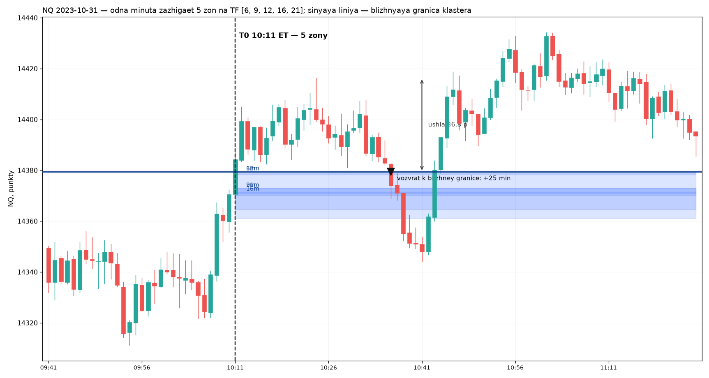

# Сцены: как объект выглядит на графике

Здесь то, чего не даёт ни словарь, ни паспорт — картинка рынка и разбор трёх
мест, где холодный агент ошибается предсказуемо. Прочти до того, как считать.
Проверено счётом 2026-09-08, числа — NQ, все ТФ 1–1440, 2006–2025.

## Кластер: рыночное событие, которого нет в поле как строки

NQ, 2023-10-31, 10:11 ET. Минутная свеча закрывается телом выше зон — и **пять
зон загораются одновременно**, на ТФ 6, 9, 12, 16 и 21. Синяя линия — верх
верхнего бокса, первая граница, которую цена встретит на обратном пути.
Дальше цена уходит ещё на 36,8 пункта и через 25 минут возвращается к линии.

Поле хранит эти пять зон как пять независимых паспортов с разными `riz_id`, и
у кластера нет ни строки, ни идентификатора, ни колонки. Он появляется только
если сгруппировать паспорта по `t0_spine_pos` — то есть если агент уже знает,
что кластер существует. Пока не знает, он считает поштучно, потому что поле
выглядит списком ризов. **Это самая частая и самая дорогая ошибка входа.**

Считать поштучно нельзя ещё и потому, что соседние ТФ дают копии одной зоны.
NQ 2024-10-17 09:00: 16 «ризов» на ТФ 455, 456, 457, 461, 462, 513, 909, 910,
912, 914, 921, 922, 923, 924, 1026, 1066 — это **три** зоны, размноженные
почти одинаковыми барами. По всему полю поштучный счёт завышает плотность в
2,9 раза: в среднем 5,29 ризов на минуту зажигания против 1,83 различных зон.

Сведение — по цене границ с допуском порядка четверти минутной свечи.
Скрипт отрисовки: [`draw_cluster.py`](draw_cluster.py).

## В минуту T0 цена стоит на линии, а не улетает от неё

T0 — это минута, чьё **тело** закрылось за границей зоны. Не ожидание
подтверждения, не второй заход: закрылось — риз синий, и на графике он синий
сразу. Но закрытие стоит за границей всего на 0,30 размаха той же минуты
([046](../../base/046-t0-eto-vozvratnaya-hodka-a-ne-uhod.md)), на NQ это около
пяти тиков.

Отсюда прямое следствие, которое стоит понимать до постановки любого теста:
первый контакт с этой границей происходит медианой **через одну минуту**, у
71,7% кластеров — за две минуты. Вход в T0 с целью на своей же границе не имеет
пространства: цель ближе комиссии. Все прежние отрицательные результаты о
касании, ретесте и возврате ([020](../../base/020-poryadok-urovnevyh-sobytiy-posle-t0.md),
044, 045, [053](../../base/053-first-contact-reclaim.md),
[056](../../base/056-uhod-retest-vozobnovlenie.md), 057) меряли именно это и
получили ноль арифметически, а не потому, что рынок ответил.

## Первое касание ничего не заканчивает

Снятие границы машина проверяет **на закрытии нативного бара** и требует, чтобы
диапазон этого бара накрыл границу целиком. Минутная тень этого не делает.
Трёхминутный риз, чью границу задела минутная тень и цена ушла обратно, горит
дальше — его нативная свеча ещё не закрылась внутри зоны. Между первым касанием
на минутной ленте и записанным снятием проходит медианой 70 минут даже на ТФ 1.

Поэтому `Film-1`, который заканчивается на первом контакте, обрывает наблюдение
в момент, для объекта ничего не значащий, и его медианная длина — **одна
минута**. Реальная жизнь линии: визитов к ней ноль у 10,8% кластеров, ровно
один у 41,9%, **два и больше у 47,3%**, в среднем 2,50, максимум 60. Всё, что
происходит со второго визита, до 2026-09-08 не измерял никто.

## Чему научил сам замер

Тест «что раньше — возврат к уровню или ещё столько же прочь» кажется
симметричным и обязанным давать 50% на пустом месте. Он даёт **46–48%**:
барьеры проверяются по экстремумам минуты, и это смещает результат вниз тем
сильнее, чем ближе барьер. Нейтраль такого стенда надо калибровать на
синтетическом блуждании, иначе слабый реальный эффект будет прочитан как его
отсутствие. Результат [060](../../base/060-vizity-k-linii-klastera.md) держится
именно на этой калибровке.
