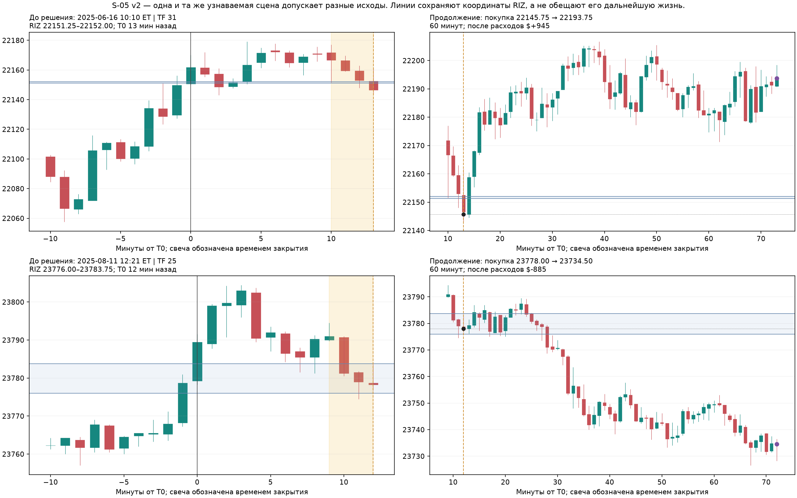
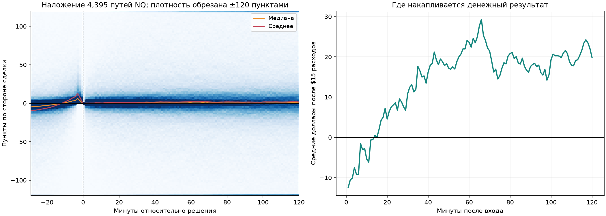
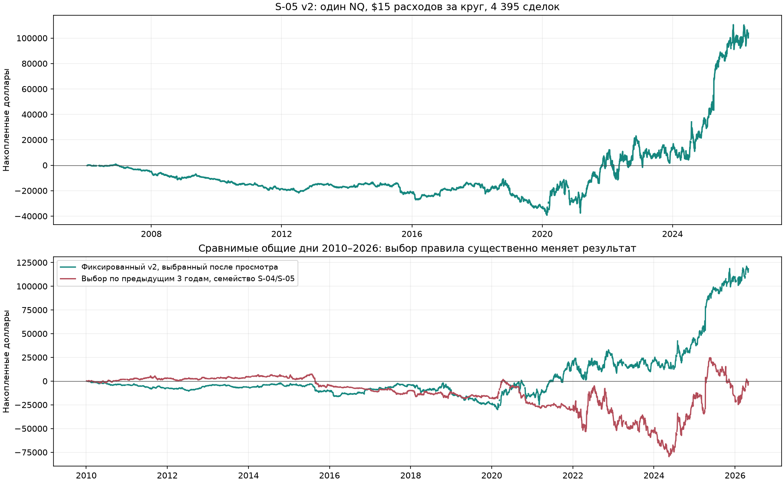

# S-05 — встречные свечи как откат к RIZ

- **состояние:** ждёт трейдера; полный исторический проход завершён.
- **исследовательский итог:** найдено частое узнаваемое событие и положительный
  исторический вариант исполнения. Устойчивое прибыльное преимущество не установлено.
- **версия:** v2, 2026-09-07; точные параметры — [selected_v2.json](S-05/selected_v2.json).
- **территория:** NQ, собственные RIZ всех ТФ 1–1440, минутные OHLC;
  архив 2006-01-05 … 2026-05-04, основная сессия акций Нью-Йорка.
- **опирается на:** новые свечные сцены этого прохода и отрицательный
  [S-04](S-04-vozvrat-vstrechnymi-svechami.md). Прежние результаты проекта
  не приняты за доказательство; 007 и S-01 использованы как пример намерения
  исследовать свечи и время, их правила не продолжались.

## Какое событие изучаем

После записанного T0 цена делает несколько последовательных встречных
закрытий и возвращается через выходную границу **того же RIZ**. Исследуем,
можно ли после этой короткой встречной серии взять возобновление хода по
стороне T0. Узнаваемая последовательность и её прибыльное продолжение —
разные утверждения: первая повторяется часто, второе оказалось неустойчивым.

Это отношения соседних закрытий, а не обязательные три красные или зелёные
свечи. Не требуется большое предшествующее удаление от зоны. Возврат может
успеть пересечь всю зону; слово «откат» обозначает проверяемое толкование,
а не установленное свойство каждого случая.

Координаты сохраняются после T0, даже если исходный RIZ уже удалён. В 1 935
из 4 395 сделок (44,0%) удаление было известно к решению. Поэтому результат
нельзя представлять как отскок от действующей зоны или подтверждение
«непроторгованной ликвидности». Жизнь зоны читается отдельно; разные RIZ
и разные инструменты не становятся одним объектом из-за общей минуты.

## Правило v2

1. Для каждого NQ RIZ берём записанный T0 от 09:30 до момента строго раньше
   чем за 30 минут до исторического закрытия NYSE. Наблюдаем последующие
   60 минут без пропусков; сигнал допустим не позднее чем за 30 минут до закрытия.
2. После северного T0 ищем **первую тройку последовательных понижений закрытия**:
   `C[q−3] > C[q−2] > C[q−1] > C[q]`, причём `C[q−3]` выше севера RIZ,
   а `C[q]` ниже него. После южного T0 всё зеркально: три повышения,
   исходное закрытие ниже юга, последнее выше. Все сравнения строгие;
   равенство не подходит. Начало серии не раньше T0.
3. Решение известно на закрытии третьей свечи. Вход — на open следующей
   минутной свечи **по стороне T0**: север — покупка, юг — продажа.
   Если этот open уже вернулся за выходную границу в сторону T0, вход отменяется.
   Нахождение внутри всей зоны не требуется.
4. На инструмент — первый подходящий момент дня и максимум одна сделка,
   один контракт. При нескольких RIZ в одной минуте сохраняются все их ID;
   для исполнения выбирается меньший ТФ, затем ID. Если стороны противоречат
   друг другу, день пропускается. Таких конфликтов в этом расчёте не было.
   После отменённого первого входа следующий сигнал в тот же день не подставляется.
5. Выход через **60 реальных минут от входа**, по закрытию соответствующей
   минутной свечи, либо раньше по календарному закрытию NYSE. В этой версии
   нет ценового стопа, цели или переворота. Временной предел — единственное
   правило выхода; денежный убыток им не ограничен.

Часы — America/New_York, с историческими сокращёнными сессиями, календарь
XNYS 4.13.2. Конвенция закрытия — [основная сессия NYSE](https://www.nyse.com/trade/hours-calendars),
а не остановка фьючерсной ленты. Метки исходных массивов относятся к закрытию
минуты; следующий open наступает сразу после закрытия сигнальной свечи.

Исполнение смоделировано по OHLC. Расход на полный оборот NQ — **$15**:
0,5 пункта совокупного проскальзывания и $5 комиссии. Один пункт NQ — $20,
минимальное изменение — 0,25 пункта по [спецификации CME](https://www.cmegroup.com/markets/equities/nasdaq/e-mini-nasdaq-100.contractSpecs.html).
Расходы — исследовательское предположение, не замер брокерских исполнений.
Точный open после проверки условия также является допущением; задержка
проверена отдельно ниже. Неизвестный исход при пропуске не заменяется нулём.

## Две сцены: одинаковое узнавание, разное продолжение

**2025-06-16, NQ, ТФ 31.** RIZ
`riz_a6177e333e73c6e2a6846b95e3d23f45`, юг 22 151,25, север 22 152,00.
Северный T0 в 09:57. В 10:10 известна цепочка закрытий
**22 166,75 → 22 159,50 → 22 153,00 → 22 146,50**.
Следующий open 22 145,75 — покупка. Через час выход 22 193,75,
**+$945** после расходов. К решению цена пересекла всю узкую зону;
сам RIZ ещё не был удалён по его родным часам.

**2025-08-11, NQ, ТФ 25.** RIZ
`riz_e369f06c1454b6a61fc108e81ce2a9e9`, юг 23 776,00, север 23 783,75.
Северный T0 в 12:09. К 12:21 закрытия
**23 791,00 → 23 781,25 → 23 779,00 → 23 778,25**.
Покупка 23 778,00, выход через час 23 734,50: **−$885**.
Удаление RIZ уже произошло в 12:20; исторические координаты остались
условием узнавания, действующей зоной они здесь не называются.

Эти иллюстрации выбраны после расчёта: ближайшие к медианному положительному
и отрицательному исходу среди сделок с 2024 года. Они объясняют правило,
а не служат независимой проверкой. Слева будущее закрыто; справа показан исход.
Предыстория и события, известные к решению, сохранены вместе с точными свечами
в data/research/S-05/illustrations_v2.json и файлах соответствующих дат.

## Частота и деньги

Всего в календаре 5 115 сессий; в NQ полностью наблюдаются 4 966.
149 неполных/недоступных сессий исключены из денежного итога как неизвестные,
а не записаны в дни без сигнала. Это ретроспективная оценка покрытия, не
доступный заранее торговый фильтр.

Из 255 650 подходящих RIZ тройка найдена у 143 390. После объединения только
одновременных сигналов это **19 550 разных минут**, а не 143 390 независимых
возможностей. Первый момент получен в 4 584 днях всего календаря;
115 первых входов отменены ценой, 10 исходов неизвестны на неполных днях.
В полном покрытии осталось 4 395 сделок и нет неизвестных исходов исполнения.
Остальные записи и причины исключения сохранены.

| Период | Дни со сделкой / известные дни | Частота | Дни без сделки |
|---|---:|---:|---:|
| Весь архив | 4 395 / 4 966 | 88,5% | 571 |
| С 2020 года | 1 493 / 1 551 | **96,3%** | 58 |
| С 2023 года | 786 / 812 | 96,8% | 26 |

Таким образом, событие почти ежедневное в современной части архива, но
не присутствует буквально каждый день. С 2020 года медиана — пять отдельных
минут узнавания на день с событием; исполнение берёт только первую.
Медиана ожидания после T0 — 8 минут, середина 80% ожиданий — 3–30 минут.
Частота сигналов не означает такую же частоту прибыльных дней.

| Мера, один контракт NQ | Результат v2 |
|---|---:|
| Чистый итог 4 395 сделок | **+$103 820** |
| Средняя / медианная сделка | +$23,62 / $0 |
| Доля положительных сделок | 49,4% |
| Просадка по закрытым сделкам | **$40 035** |
| Просадка с открытой позицией | $40 880 |
| Худшая закрытая сделка | −$9 900 |
| Наибольшее движение против открытой позиции от входа | **$28 730** |
| Итог 2006–2019 | −$33 440 |
| Итог с 2020 года | +$137 260 |

Внутриминутная последовательность high/low неизвестна; обе допустимые
крайние очередности дали одинаковую максимальную просадку $40 880.
Открытый убыток $28 730 — наблюдённый максимум, не предел будущего риска
и не требуемый размер счёта. Маржа, финансирование и реальные ограничения
брокера не моделировались. Отсутствие ценового стопа существенно для результата.
Годы перечислены в [yearly_v2.csv](S-05/yearly_v2.csv); 2020 год выделен после
просмотра и не превращён в заранее найденную границу рыночного режима.

## Наложение свечных путей и слабые места

Все сделки совмещены по моменту решения и стороне T0. По вертикали — пункты
NQ, по горизонтали — минуты; это не средняя полная амплитуда движения.
Плотность рисунка ограничена диапазоном ±120 пунктов для читаемости, исходные
пути сохранены без такого ограничения. Встречная тройка видна до решения,
но после неё узкого общего прибыльного «трафарета» не получилось.
Средний чистый результат при выходе через 5 минут — −$9,15, через 10 — −$5,37,
через 30 — +$10,85, через 60 — +$23,62. Для этой конструкции короткий участок
1–10 минут расходы не покрывает. Это не вывод об отсутствии иных микросетапов.

После исключения лучшего дня остаётся +$79 600; после лучших десяти —
+$27 655. Но лучшие 44 дня (около 1% сделок) дают 199% всего чистого плюса:
без них итог **−$102 880**. Такой вклад редких больших движений — существенная
слабость обещания зарабатывать на повседневном повторении формы.
Обычный блочный интервал среднего дневного результата — примерно
**от −$3,12 до +$45,66**: ноль внутри даже без поправки на выбор победителя.
Использованы 3 000 повторов блоками по 20 дней; предположение — слабая
стабильность дневного процесса. Это ориентир неопределённости, не доказательство
значимости после всего адаптивного поиска.

| Проверка исполнения | Сделки | Чистый итог |
|---|---:|---:|
| Базовые расходы $15 за оборот | 4 395 | +$103 820 |
| Расходы $25 | 4 395 | +$59 870 |
| Расходы $45 | 4 395 | −$28 030 |
| Вход ещё на минуту позже, те же правила отмены | 3 717 | +$55 475 |
| Эта задержка и расходы $25 | 3 717 | +$18 305 |

Уже рассмотренный вариант со стопом за дальней границей RIZ дал +$10 745,
но только 1 157 сделок: 3 405 первых входов отменены, медиана удержания
две минуты, доля положительных исходов 14,5%. Это другая по частоте и риску
конструкция; переносить на неё ежедневность и плюс временной версии нельзя.
Точное правило k3/w60/60 без стопа на ES дало −$92 390, на YM — −$41 080.
Обобщение на все три индекса не установлено.

## Как выбирали и что выдержало перепроверку

Разведка началась с 12 новых свечных сцен ES/NQ, выбранных по координатам
и фиксированному seed, без отбора по исходу. Затем S-04 проверила присоединение
к встречной серии; 216 вариантов оказались отрицательными после расходов.
После этого S-05 проверила противоположное действие ещё в 216 вариантах:
3 инструмента × 2/3/4 закрытия × ожидание 10/30/60 минут × удержание
15/30/60/120 минут × выход по времени/стопу. Победитель по полной прибыли v1
был NQ/k4/w30/60: +$108 470, но только 87,1% известных дней с 2020 года.
После уточнения ежедневности выбрана v2 с тремя закрытиями и ожиданием до часа.
Это выбор с уже увиденными исходами; старые результаты сохранены.

Перед расчётом зафиксирован годовой способ выбора: по предыдущим трём полным
календарным годам выбрать вариант с наибольшим средним чистым результатом
на общий известный день, минимум 30 сделок и 80% доступных общих дней;
если лучшая оценка неположительна, следующий год не торговать.
Расчёт следующего года выполняется без изменения выбранного правила.

| Семейство, выбор по прошлым годам, 2010–2026 | Итог | Просадка |
|---|---:|---:|
| Только S-04 | −$69 237,50 | $84 072,50 |
| Только S-05 | +$19 650 | $74 740 |
| **Всё сохранённое семейство S-04/S-05, 432 варианта** | **−$612,50** | **$87 137,50** |

Основная оценка выбора — последняя строка: она включает обе реально проверенные
стороны сделки. Она не воспроизвела привлекательный итог фиксированного v2.
Этот годовой выбор лишь частично представляет реальный поиск: он не учитывает
точно визуальное рождение идеи, адаптивную смену толкования, выбор частоты
автором и неизвестный полный перебор прежних исследований проекта.
Поминутно также просмотрены 120 горизонтов v1 и 120 v2; пик этих кривых не
использован для новой настройки. Полная локальная история — [SEARCH.md](S-05/SEARCH.md).

135 проверок узнавания на действительно обрезанных лентах совпали;
проверены гэп через стоп, внутриминутный стоп, выход по часам, отмена и
неизвестность при пропуске. v2 заново распознана из копии паспортов,
журнал совпал с исходным расчётом. У всех 4 395 сделок независимо сверены
исходные закрытия, вход, часы выхода и деньги. Проверки общего слоя: 64 passed.
Результаты — [verification_v2.json](S-05/verification_v2.json) и
[checks_before_outcomes.json](S-04/checks_before_outcomes.json).
Повтор того же архива независимого подтверждения не создаёт.

## Вывод исследователя

Продвижение состоит в точном отделении **почти ежедневного события около
координат RIZ** от ожидания зарабатывать на нём. Такое событие найдено и
узнаётся без будущих свечей. Выбранное действие исторически положительно,
но короткий участок не окупился, крупный открытый риск и зависимость от
редких удач существенны, а оценка способа выбора преимущества не установила.
Сохраняю v2 как проверенный исторический кандидат, **не представляю его
как установленную прибыльную торговую систему**.

Особая полезность расположения именно у RIZ по сравнению с такой же серией
в сопоставимое время вне RIZ отдельно не установлена. Известные координаты
задают наблюдаемую сцену, но сами по себе не доказывают причину продолжения.
Повторная настройка минут на этой кривой не устраняет выявленную неопределённость.

Код, повторение, просмотр любой выбранной даты и карта файлов —
[S-05/README.md](S-05/README.md). Источник котировок, правило склейки и исходная
временная зона остаются ограничениями [SOURCE_DATA.json](../SOURCE_DATA.json);
здесь использована принятая каноническая интерпретация без её изменения.
Поле только прочитано; новых данных и пересборки не было.
