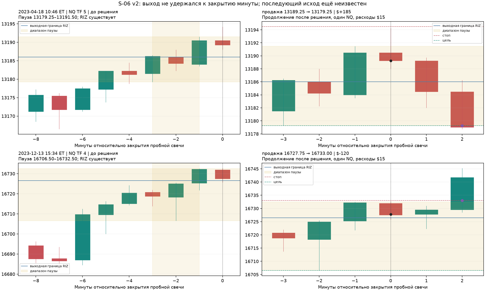

# S-06 — свечная пауза у RIZ

- **состояние:** закрыт по собственным результатам; v1/v2/v3 отрицательны.
- **исследовательский итог:** все 144 правила трёх версий отрицательны после
  расходов. Уточнение объекта (закрытия внутри общей области) срезало более
  трёх четвертей минут узнавания на NQ и не изменило знак денег; 2026-09-07.
- **территория:** существующее замороженное поле ES/NQ/YM, минутные OHLC,
  каждый ТФ 1–1440; без рыночного объёма и новых котировок.
- **опирается на:** пока нет готового преимущества. S-04/S-05 и переданные
  трейдером последующие отрицательные исследования — материал для критики.

## Что увидели

После пересечения RIZ цена иногда несколько минут остаётся в общей области.
В ES 2025-11-17/ТФ150 после южного T0 пауза у юга разрешилась вверх;
в YM того же дня/ТФ113 — вниз. Направление T0 не назначает сторону выхода.
ES 2025-07-10/ТФ46 показывает похожую паузу уже после удаления RIZ — это
не переносится в новую действующую популяцию.

Новая информация — отношение диапазонов соседних минутных свечей и выход
из их общей области. Это отдельная линия, не ещё одно время удержания S-05.
Прочитаны одна незнакомая сцена по обрезанному префиксу и 12 координатно
выбранных сцен без отбора по исходу. Адреса, развитие догадки и точные правила
до результатов — [SEARCH.md](S-06/SEARCH.md). Исходные картинки:
[ES](S-06/ES_observe.png), [NQ](S-06/NQ_observe.png), [YM](S-06/YM_observe.png).

Пауза: три либо пять минутных свечей после T0 имеют общее пересечение
диапазонов, `max(low) < min(high)`. Их общий внешний диапазон затрагивает
выходную границу **своего** RIZ. Объект существует при решении. Наблюдение
продолжается до известного удаления, разрыва или конца той же основной сессии.
Общего лимита +60 минут нет; возраст в собственных барах сохранён, но не
подбирался. Свечной диапазон не становится новым RIZ и не доказывает сжатия заявок.

## Два проверенных действия

**v1 — пробой.** Вход при выходе на шаг за край паузы либо после закрытия
следующей свечи вне диапазона по следующему open, пока он остаётся за этим
краем. В первом способе на одну минуту выставляются два взаимно отменяемых
входа; несработавшая попытка истекает. Стоп — на шаг за противоположным краем.
Если свеча открылась между уровнями и прошла оба, неизвестна первая сторона,
но обе очередности дают одинаковый стоп. Такие случаи остаются в расчёте.

**v2 — выход не удержался.** Следующая после паузы свеча открылась и закрылась
внутри неё, проколола один край и не вышла за другой. Следующий open внутри
паузы — вход в обратную сторону: покупка после нижнего прокола, продажа после
верхнего. Стоп — на шаг за хвостом прокола. Сравниваются цель на противоположном
краю паузы и выход только по времени со всё тем же стопом. Для исполнения
цели требуется проход уровня на шаг, без улучшения на гэпе. Одно касание
не объявляется гарантированным заполнением лимитной заявки.

В обеих версиях выход на закрытии 5/15/30-й минутной свечи, считая минуту
входа первой, не позже исторического NYSE close. При входе по open это
5/15/30 реальных минут; при входе/выходе внутри M1 точная доля минуты неизвестна.
Стоп через гэп заполняется по худшему open. Если стоп и цель внутри одной
минуты, основной результат использует стоп, дополнительный — цель.

Один контракт, одновременно одна позиция на инструмент, все неперекрывающиеся
сигналы. Это более частое исполнение, чем одна сделка в день в S-05; абсолютные
суммы нельзя сравнивать без оборота. В общей минуте все RIZ остаются в
распознавании, на ценовой выход приходится одна позиция; представитель —
меньший ТФ, затем ID. Расходы за оборот: ES $30, NQ/YM $15, как в S-04/S-05.
Это модель, не брокерские исполнения. Календарь — XNYS 4.13.2, America/New_York,
с историческими сокращёнными сессиями. Входы вне основной сессии не рассматриваются.

## Частота и деньги

Пауза из трёх свечей найдена в 245 804 отдельных минутах 4 781 сессии NQ.
С 2020 года — в 1 509 из 1 551 полностью наблюдаемой сессии (97,3%).
Миллионы строк «RIZ × пауза» не являются миллионами независимых возможностей.
Полностью наблюдаемые сессии: ES 5 002, NQ 4 966, YM 4 895 из 5 115 календарных.
Остальные дни неизвестны, а не равны нулю. Полнота дня оценивается ретроспективно
и не является доступным на открытии торговым фильтром.

Два частых коротких варианта ниже — **иллюстрации, не выбранные победители**:
NQ, три свечи паузы, максимум пять минутных свечей позиции.

| Мера | Пробой на самом выходе, v1 | Прокол и возврат с целью, v2 |
|---|---:|---:|
| Сделки за весь архив | 65 898 | 51 265 |
| Дни со сделкой с 2020 года | 1 502 / 1 551 | 1 442 / 1 551 |
| Частота дней со сделкой | 96,8% | 93,0% |
| Сделки на активный день с 2020 | 16,4 | 15,0 |
| Средняя сделка до расходов | −$1,89 | −$0,66 |
| Средняя сделка после расходов | **−$16,89** | **−$15,66** |
| Чистый итог | −$1 113 225 | −$802 945 |
| Медиана расстояния до исходного стопа | 5,75 пункта NQ / $115 | 2,50 пункта NQ / $50 |
| Худшая исполненная сделка | −$7 425 | −$2 550 |

Расстояние до назначенного стопа и полученный убыток с гэпом/расходами —
разные величины; стоп не гарантирует денежного потолка. Медиана возраста
RIZ в этих сделках — 0,46/0,44 своего бара, средние 80% — примерно
0,04–2,78/0,04–2,46 бара. Это распределение сделок, не закон жизни объектов.

| Период | v1, средняя чистая сделка | v2, средняя чистая сделка |
|---|---:|---:|
| 2006–2012 | −$15,59 | −$16,47 |
| 2013–2019 | −$16,09 | −$15,50 |
| 2020–2026 | −$18,61 | −$15,33 |

Ни одно из 36 правил v1 и 36 правил v2 не дало положительного чистого итога.
Ближайший к нулю v1 — YM/пять свечей/вход после закрытия/30 минут:
−$189 885 на 13 409 сделках. У v2 лучший итог — YM/пять свечей/без цели/
30 минут: −$211 100 на 14 172 сделках. Положительные валовые суммы отдельных
вариантов не покрывают расходы. Все результаты — [v1](S-06/summary_v1.csv),
[v2](S-06/summary_v2.csv).

Во всех 36 вариантах v2 благоприятная очередность стопа и цели тоже оставляет
минус. Для указанного NQ v2 она улучшает итог лишь до −$743 955. Задержка
входа на минуту: −$524 325 на 31 366 сделках. Это проверки данного действия,
не доказательство отсутствия иных свечных сетапов.

## Свечи, повтор и выбор

Реальные исполненные сделки NQ v2: ближайшие к медианному положительному и
отрицательному исходу с 2023 года. Иллюстрации выбраны после результатов.
Слева будущее закрыто; справа продолжение. Синяя линия — выходная граница
конкретного RIZ, жёлтая область — другая величина, диапазон свечной паузы.
Полные координаты, ID и цены — data/research/S-06/scenes.json и свечные файлы рядом.

108 физических обрезаний ленты подтвердили неизменность узнавания: 72 для
v1 с обоими входами, 36 для v2. 20 различающих проверок исполнения покрыли
гэпы, зеркальные стороны, касание без исполнения цели, очередности барьеров,
временной выход, пропуск и занятость позиции. Оба приведённых NQ-варианта
заново распознаны из паспортов и OHLC, весь журнал совпал. Все их **117 163
сделки** независимо сверены по исходным свечам; дневные деньги и числа сделок
всех 72 правил согласованы. [Проверка](S-06/verification.json).

Годовой выбор по прошлым трём годам, с прежними условиями достаточности
данных и правом не торговать, для S-06 остаётся вне рынка: $0, 0 сделок.
Это отказ от отрицательных вариантов, а не прибыльная система. Общее
сохранённое семейство S-04/S-05/S-06 теперь содержит 504 правила; его выбор
по прошлому остался на −$612,50, просадка $87 137,50. Такая оценка не покрывает
точно визуальное рождение идей и неизвестный полный перебор других агентов
из переданной [заметки](S-06/LENSES_FROM_USER.txt). Её числа не выдаются за
наши проверенные измерения. Независимого подтверждения нет.

## v3 — закрытия внутри общей области

На итоговых иллюстрациях стало видно, что пересечение теней допускает
поступательно растущие закрытия: слово «пауза» было шире посчитанного.
Уточнение: **все** закрытия свечей паузы лежат в общей области их диапазонов
включительно, `min(close) >= max(low)` и `max(close) <= min(high)`. Остальное —
стороны, стопы, горизонты, активность RIZ, календарь, расходы, занятость —
сохранено, повторены те же 36 + 36 правил. Это новая разведочная версия
после увиденных результатов, не независимая проверка.

Предмет счёта сузился сильно: на NQ три свечи — 52 669 минут вместо 245 804,
пять свечей — 3 999 вместо 110 045. Пауза перестала быть почти ежедневной
только на пяти свечах; на трёх она остаётся частой.

| Узнавание v3 | ES | NQ | YM |
|---|---:|---:|---:|
| Минут, три свечи | 68 401 | 52 669 | 49 135 |
| Доля известных дней с 2020, три свечи | 87,5% | 91,2% | 89,5% |
| Минут, пять свечей | 11 454 | 3 999 | 3 447 |
| Доля известных дней с 2020, пять свечей | 37,4% | 31,4% | 25,5% |

Денег это не дало. Ни одно из 72 правил v3 не положительно; валовая сумма до
расходов положительна у 11 из них. Лучший чистый итог — NQ/пять свечей/вход
после закрытия/30 минут: **−$25** на 847 сделках, то есть ровно расходы
съедают приблизительно нулевой валовый результат. Худший — ES/три свечи/пробой
на выходе/5 минут: −$907 367,50 на 23 236 сделках. Все — [v3](S-06/summary_v3.csv).

Годовой выбор по прошлым трём годам впервые вывел S-06 в рынок и проиграл:
−$22 950 на 1 307 сделках, просадка $27 850, выбранные годы 2020, 2021, 2023,
2025, 2026 ([расчёт](S-06/selection_after_v3_S06.csv)). Совместный выбор с
S-04/S-05 не изменился: −$612,50 при просадке $87 137,50 — ни один вариант v3
не побеждал в отборе по прошлому. Сохранённое семейство — 576 правил.

Проверка v3 повторена отдельно: свежее узнавание и свежий фильтр закрытий
совпали с сохранёнными строками, две иллюстративные NQ-конфигурации заново
воспроизведены целиком, их **33 012 сделок** сверены прямо по сырым минутам
вместе с самим условием закрытий, дневные деньги и числа сделок всех 72 правил
сошлись ([проверка](S-06/verification_v3.json)). Эпохи NQ/три свечи/пробой:
средняя чистая сделка −$15,37 (2006–2012), −$16,45 (2013–2019), −$24,47
(2020–2026); у прокола с целью — −$16,73 / −$15,59 / −$12,15. Задержка входа
на минуту у второго: −$104 600 на 6 435 сделках вместо −$156 575 на 10 706.
Убыток уменьшается пропорционально числу сделок, а не исчезает.

## Вывод

Частая свечная форма у действующего RIZ найдена; все три проверенные торговые
трактовки закрыты по собственным результатам. **Сцена может дать однозначную
цену отмены идеи, не давая выгодного соотношения выигрышей и потерь.**
Это точнее, чем объявлять сценический стоп невозможным или ждать прибыли
от одной правильной геометрии. Сохранение собственных часов и исключение
уже удалённых RIZ сами по себе тоже не создали преимущества.

Отдельно установлено уточнением v3: **сужение объекта в сторону «настоящей»
паузы убирает сделки, но не убыток на сделку.** Убрав три четверти минут
узнавания, мы получили те же отрицательные средние; выигрывает только
уменьшение оборота. Это ослабляет объяснение «прежний минус — от мусорных
срабатываний» и переносит вопрос с определения формы на то, чем различаются
исходы одной формы. Общая для всех 144 правил величина — расход $15–30 за
оборот против медианного риска $35–115 и валовой суммы около нуля: действие
такого масштаба проигрывает, даже когда угадывает сторону чаще случайного.

Избирательное исполнение других содержательно различимых подтипов здесь
не проверялось. Новые пороги времени, ширины и ТФ из этих убытков не выбирались.
Для возврата к линии нужно новое наблюдение, меняющее ожидаемый оставшийся
путь, а не ещё один победитель среди настроек той же паузы.

Повторение и просмотр даты — [README](S-06/README.md). Паспорта и манифесты
4 320 ячеек, OHLC/время и SOURCE_DATA сверены с исходными хешами: изменений нет.
Неизвестные происхождение фида, склейка и первичная временная зона остаются
ограничениями [SOURCE_DATA.json](../SOURCE_DATA.json).
