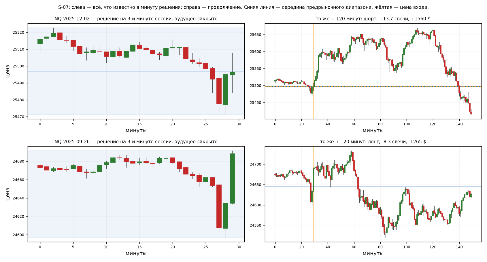

# S-07 — дрейф первых минут сессии

- **состояние:** кандидат с проверенным историческим расчётом, версия заморожена.
  Ждёт решения трейдера; одобрением и разрешением на живую торговлю не является.
  Держать вместе с прежней совместной линией S-04/S-05/S-06 не стоит: денег она
  не добавляет, а просадку и худший день почти удваивает. Ведение v1 проверено
  отдельно: выход на 15-й минуте делает убыточными обе ранние эпохи, и есть
  кандидат на v2 без него — решение об обмене «деньги против просадки» за
  трейдером.
- **исследовательский итог:** сторона по предрыночному положению цены, решение
  на 3-й минуте сессии, удержание до 120 минут. NQ 2020–2026 в замороженном
  ведении: +$236 265 на 1 563 сделках, 7 прибыльных лет из 7, просадка $30 960,
  худший день −$4 620. Явление держится в свечах 18 лет из 21 и на трёх
  инструментах; деньгами становится там, где свеча дороже расхода.
- **версия:** v1, заморожена 2026-09-07. Хеши кода, входов и среды —
  [FROZEN_v1.json](S-07/FROZEN_v1.json). Параметры дальше не подбираются:
  изменение любого — новая версия со своим номером и строкой в истории выбора.
  Действующая ревизия исполнения — **v1r1**: полное правило собрано в одном
  расчёте, часы разведены, гэп за предел исполняется честно.
  Деньги при этом не изменились ни на доллар; вычисленный итог и все счётчики —
  [result_v1r1.json](S-07/result_v1r1.json), разбор — раздел «Ревизия v1r1».
- **территория:** NQ основной кандидат; ES/YM посчитаны и не проходят. Минутные
  OHLC 2006-01-05 … 2026-05-04, основная сессия NYSE, America/New_York.
  Входов вне основной сессии нет, всё закрывается внутри неё. Поле RIZ не
  используется. Объёма нет.
- **опирается на:** ничего из `base/`. Правило пришло из переданной трейдером
  заметки как «базовый уровень для сравнения», не как кандидат; здесь оно
  впервые исполнено как сделка с расходами и ведением.

## Откуда идея и что видно

В переданной трейдером заметке строка «сторона по положению цены в 30-свечном
окне даёт +0,088 свечи за час и +0,593 в первые пять минут сессии» стояла как
база для сравнения находок. Её никто не исполнял как сделку.

Проверка профиля подтвердила форму: часовой ход в сторону предрыночного
положения цены даёт +0,90…+1,01 свечи в первые пять минут сессии против
+0,07…+0,12 в среднем по сессии, во всех трёх эпохах, и затухает к 30-й минуте.
Профиль по минутам решения гладкий, с максимумом на 3–4-й минуте и переходом в
минус к 8-й. Это форма явления, а не выживший срез перебора.

Что идея добавляет к S-04/S-05/S-06: она не о геометрии RIZ. Прежние кандидаты
искали направление в сцене у границы объекта и все закрыты. Здесь используется
другое доступное знание — время суток и положение цены относительно того, что
рынок наторговал до открытия акций.



Слева — всё, что известно в минуту решения, будущее физически отрезано; справа
то же самое плюс 120 минут. Синяя линия — середина предрыночного диапазона,
жёлтая — цена входа. Сверху NQ 2025-12-02: цена на 09:33 ниже середины, шорт,
+13,7 свечи (+$1 560). Снизу NQ 2025-09-26: цена выше середины, лонг,
−8,3 свечи (−$1 265). Обе выбраны как ближайшие к медианному исходу своей группы
с 2023 года, то есть после результата: они иллюстрируют правило, а не доказывают
его. Координаты — [scenes.json](S-07/scenes.json).

**Важно: эти две сцены показывают простое удержание 120 минут, а не ведение
версии v1.** Под замороженным правилом обе — убытки: цена в обеих сначала ушла
против входа больше чем на 16 свечей, и катастрофический лимит закрыл их
раньше (−$1 855 и −$2 415). Верхняя сцена особенно наглядна: день, который на
голом удержании даёт +13,7 свечи, под v1 остаётся минусом. Сцены, показывающие
само правило v1, — 2024-05-20 (лонг, 120 минут, +26,8 свечи, +$1 860) и
2024-12-03 (шорт, выход на 15-й минуте, −3,6 свечи, −$725).

## Что делаем

**Узнавание и отказ.** Основная сессия NYSE по календарю XNYS
(America/New_York, исторические сокращённые сессии учтены). Минута сессии 0 —
та, что закрывается в 09:30 ET, то есть последняя минута перед открытием;
`calendar.parquet` хранит в `open_ns` именно её закрытие. Решение принимается
на закрытии минуты 3 (09:33 ET), вход — по open минуты, идущей за ней. Нужны 30 непрерывных закрытых минут до неё — это предрыночные
данные, они обязательны. Если минутная сетка рвётся, если минуты входа нет или
если сессия сокращена так, что впереди нет минуты входа, — дня нет. Пропущенный
день не считается нулём: он не наблюдался.

**Вход и направление.** Пусть `H` и `L` — максимум и минимум за последние 30
закрытых минут, `mid = (H + L) / 2`. Сторона `+1`, если close минуты 3 строго
выше `mid`, иначе `−1`. Вход рыночной заявкой по open следующего минутного
интервала. Условий подтверждения нет: цена входа известна и равна этому open.

**Метка свечи и момент исполнения — разные вещи.** У свечи с close-меткой 09:34
open относится к началу интервала 09:33–09:34, то есть к 09:33:00 — к самому
моменту решения, а не к 09:34. Читать «вход по минуте 09:34» как исполнение в
09:34 нельзя: это другая минута риска. Отсюда же видно, что цена входа и close
минуты решения — два разных числа: на корпусе проекта они совпадают лишь в 44%
дней, средняя разница 0,21 пункта. Точные timestamp решения, входа, 15-й и
120-й минуты проверены и сохранены в
[result_v1r1.json](S-07/result_v1r1.json) (`clock_sample`); 15-я минута позиции
приходится на 09:48, 120-я — на 11:33.

**Единица счёта.** Свеча — медиана истинного диапазона последних 30 закрытых
минут, зафиксированная в минуту решения и не пересчитываемая внутри сделки.
Ведение и риск считаются в этой единице, а не в пунктах и не в процентах.

**Ошибка идеи, ведение и выход.** Три правила в порядке приоритета:

1. **Катастрофический лимит 16 свечей** от цены входа. Проверяется по минутному
   экстремуму; при разрыве через уровень исполняется по худшему open. Это
   [защитное ограничение, а не ошибка идеи](../GLOSSARY.md#idea-error-vs-protective-limit--ошибка-идеи--защитное-ограничение):
   уровень выбран по деньгам — 16 свечей стоят 1,8% итога и втрое обрезают
   худший день, — а не по наблюдению, после которого догадка перестаёт держаться.
   Наблюдаемой ошибки идеи у этого кандидата нет: профиль MAE показывает, что
   любой рабочий стоп режет собственных победителей. Обещание «при разрыве через
   уровень — по худшему open» до ревизии v1r1 выполнял только `run.py`;
   `manage.py`, считавший числа v1, заполнял ровно по уровню.
2. **Выход на 15-й минуте позиции, если она в минусе** по закрытию этой минуты.
3. Иначе **держать 120 минут** и выйти по close, но не позже закрытия сессии.

**Безубыток не переносится никогда, трейлинг не ставится.** Это не пропуск, а
измеренный результат — см. раздел о ведении.

Как часто срабатывает каждое правило, NQ 2020–2026: держали все 120 минут —
46,8% дней, вышли на 15-й минуте в минусе — 42,7%, поймали катастрофический
лимит — 10,5%. То есть почти половина дней закрывается через 15 минут.

**Позиции.** Один вход в день на инструмент, один контракт в базовом расчёте,
перекрытий нет по построению. Расходы $15 за полный оборот NQ ($30 ES) вычтены
из каждой сделки; проскальзывание сверх этого не моделировалось.

## Что показал расчёт

NQ, замороженное ведение (лимит 16 свечей + выход на 15-й минуте при минусе):

| | 2006–2012 | 2013–2019 | 2020–2026 |
|---|---:|---:|---:|
| Сделок | 1 557 | 1 737 | 1 563 |
| Средний ход в свечах | 0,79 | 1,01 | 1,43 |
| Средняя сделка после расходов | −$4,4 | +$9,7 | **+$151,2** |
| Итог | −$6 895 | +$16 815 | **+$236 265** |
| Просадка | $11 960 | $13 460 | $30 960 |
| Худший день | −$805 | −$1 935 | −$4 620 |

По годам 2020–2026: +$13 555 / +$24 525 / +$43 160 / +$22 405 / +$31 705 /
+$64 795 / +$36 120 — **7 прибыльных лет из 7**. Без ведения («держать 120
минут») итог выше, +$273 050, но годы рванее (при горизонте 60 минут 2021-й даёт
всего +$1 685), просадка растёт до $43 985, худший день до −$12 770. Версия v1
выбрана по ровности и ограниченному риску, а не по максимуму итога.

**Хвост.** Без лучших 5% дней 2020–2026 остаётся −$163 270. Медиана сделки в
управляемой версии отрицательная (−$290) при доле прибыльных 36%: правило часто
теряет понемногу и редко берёт много. Оценивать его средним по сделке нельзя,
размер позиции здесь важнее точки входа.

**В свечах явление старше денег.** NQ 18 прибыльных лет из 21, ES 18 из 21,
YM 16 из 21. Денежная торгуемость определяется отношением стоимости свечи к
расходу: медианная свеча NQ выросла с $15 до $120 при неизменных $15 за оборот.
В 2006–2012 расход съедал почти всю свечу, поэтому та же закономерность давала
ноль. Это смена барьера издержек, а не рыночного режима.

**Это не покупка растущего индекса.** Доля лонгов 49,2%, прибыльны обе стороны
(в 2020–2026 без ведения шорты +$204, лонги +$146 за сделку), а слепой лонг на
те же 120 минут убыточен во всех эпохах: −$10,9 / −$7,1 / −$40,9. Правило минус
слепой лонг: +$80,8 на сделку.

**Инструменты.** ES около нуля (расход $30 против меньшей свечи), YM в
2020–2026 отрицателен. Кандидат — только NQ.

## Ведение: что делать после входа

Для каждой минуты позиции считался **оставшийся** путь до 120-й минуты в свечах
при состоянии, известном на этой минуте. NQ, 2020–2026:

| Минута | Состояние | Средний остаток, свечи | Доля с положительным остатком |
|---|---|---:|---:|
| 15 | в плюсе | +2,03 | 0,566 |
| 15 | в минусе | +0,29 | 0,510 |
| 20 | три встречные свечи подряд | −0,64 | 0,497 |
| 30 | в плюсе | +0,76 | 0,533 |
| 30 | три встречные свечи подряд | −0,42 | 0,429 |
| 45 | в минусе | −0,01 | 0,501 |
| 45 | вернулась за уровень решения | −0,29 | 0,488 |
| 45 | три встречные свечи подряд | −1,13 | 0,487 |
| 60 | в плюсе | +0,35 | 0,539 |

Асимметрия ясная: **прибыльная позиция продолжает приносить весь час, убыточная
теряет продолжение к 45-й минуте.** До 15-й минуты минус ничего не значит —
остаток у минусовых позиций там ещё положительный, выходить рано. Наблюдаемые
ранние признаки провала: три встречные закрытые свечи подряд после 20-й минуты
и возврат за уровень решения `mid` после 45-й.

Проверено 20 правил ведения; итог 2020–2026 и отношение дохода к просадке:

| Правило | Итог | Просадка | Доход/просадка | Свечи по эпохам |
|---|---:|---:|---:|---|
| выход на 15-й минуте при минусе | $240 505 | $32 460 | **7,41** | 0,95 / 1,00 / 1,43 |
| держать все 120 минут | $273 050 | $43 985 | 6,21 | 1,47 / 0,94 / 1,56 |
| выход на 30-й, если ниже −1 свечи | $227 705 | $39 225 | 5,81 | 1,33 / 0,74 / 1,47 |
| выход после 4 встречных свечей | $120 940 | $25 840 | 4,68 | 0,86 / 0,67 / 0,93 |
| стоп 6 свечей | $148 380 | $32 200 | 4,61 | 0,52 / 0,87 / 1,15 |
| безубыток после +2 свечей | $121 085 | $53 250 | 2,27 | 0,33 / 0,76 / 0,75 |
| трейлинг: откат 3 свечи | $73 085 | $41 605 | 1,76 | 0,07 / 0,41 / 0,44 |

**Безубыток стоит больше половины результата и увеличивает просадку** — цена
почти всегда возвращается к входу до того, как уйдёт в свою сторону. Трейлинг
поднимает долю прибыльных сделок до 67% и срезает итог вдвое: обычная плата за
обрезанный правый хвост. Единственное окупающееся вмешательство — выход на
15-й минуте при минусе.

## Риск: лимит дня и размер позиции

Сделка одна в день, поэтому дневной лимит есть предел одной сделки, и он должен
быть катастрофическим, а не рабочим. Поверх выхода на 15-й минуте, 2020–2026:

| Лимит | Итог | Просадка | Худший день | Доля задевших |
|---|---:|---:|---:|---:|
| нет | $240 505 | $32 460 | −$12 770 | — |
| 20 свечей | $248 515 | $34 140 | −$5 615 | 5,2% |
| **16 свечей (версия v1)** | $236 265 | $30 960 | **−$4 620** | 10,5% |
| 12 свечей | $191 805 | $34 430 | −$4 620 | 22,1% |
| 8 свечей | $158 610 | $36 160 | −$4 895 | 43,3% |

Лимит 16 свечей стоит 1,8% итога и втрое обрезает худший день. Ниже 12 свечей
он превращается в рабочий стоп и начинает съедать результат.

Размер считается в свечах и потому переносится между эпохами:

**контрактов = ⌊допустимый риск на сделку / (16 × стоимость свечи)⌋**,

где стоимость свечи известна в минуту решения (`unit × цена пункта`; для NQ
цена пункта $20).

| | медианная свеча | 16 свечей | контрактов при риске $2 000 |
|---|---:|---:|---:|
| 2006–2012 | $15 | $240 | 8 |
| 2013–2019 | $25 | $400 | 5 |
| 2020–2026 | $120 | $1 920 | 1 |

Один контракт NQ сегодня несёт около $1 920 риска на сделку. Счёт, для которого
это 1% капитала, — примерно $190 000; при меньшем счёте инструментом становится
микроконтракт, а не более узкий стоп. Распределение исхода 2020–2026 без
ведения, в свечах: 1% = −43,9, 5% = −27,1, медиана +1,1, 95% = +29,1, 99% = +46,0.

## Перепроверка версии на истории

До перепроверки было названо, что считать пригодным: положительные деньги после
расходов, частота, близкая к ежедневной, и устойчивость знака по эпохам и годам.

- **Стоимость выбора — и что она покрыла.** Посчитаны 675 конфигураций
  (3 инструмента × 15 минут решения × 3 горизонта × 5 стопов 0/2/4/6/10 свечей).
  Годовой выбор по прошлым трём годам среди этих 675 даёт +$204 150 при просадке
  $55 615 и 14 прибыльных годах из 17. Победители разных лет — соседние
  конфигурации (минуты 1–9, горизонты 60/120, без стопа), то есть плато, а не
  острие. Проигравшие сохранены в [summary_v1.csv](S-07/summary_v1.csv).

  **Покрыто этой процедурой:** инструмент, минута решения, горизонт удержания и
  стоп из перечисленных пяти. Про них и сказано, что результат не создан выбором
  задним числом. **Не покрыто:** предел 16 свечей (его в сетке нет), выход на
  15-й минуте, 20 правил ведения, 7 уровней предела, окно 30 минут и само
  определение единицы-свечи. Всё это выбрано отдельно, уже видя исходы, и
  адаптивным остаётся. Годовой выбор оценивает одну процедуру, а не всю историю
  подбора кандидата.
- **Префикс.** 195 дней проверены физическим обрезанием ленты на минуте входа:
  сторона и цена входа не меняются от будущих минут.
- **Эпохи.** Знак в свечах положителен во всех трёх эпохах у выживших правил;
  разбиение сделано до доклада.
- **Хвост.** Назван прямо: без лучших 5% дней результат отрицателен.
- **Поле RIZ как фильтр — отвергнуто.** Расщепление по состоянию поля в минуту
  решения (цена внутри живой непроторгованной зоны против вне всех зон) на NQ
  давало 1,94 против 1,10 свечи, но на ES знак обратный во всех трёх эпохах, а
  на YM зависит от минуты решения. Гипотеза «свободный путь впереди лучше» тоже
  неверна: близкая граница по ходу давала больше, а не меньше. Расчёт —
  [field_across_v2.csv](S-07/field_across_v2.csv).
- **Чего нет.** Независимого подтверждения: тот же архив, тот же корпус, и
  правила ведения подобраны на той же истории — 20 правил и 7 лимитов. Устойчиво
  здесь то, что почти любое активное вмешательство ухудшает результат, а не
  конкретные числа 15 и 16. Проскальзывания сверх фиксированного расхода нет.
  Самое оптимистичное допущение конструкции — не вход (он идёт по следующей
  доступной цене), а **выход: и проверка на 15-й минуте, и удержание 120 минут
  исполняются по close той же минуты, на закрытии которой принято решение.**
  Измерением это не подтверждено и ревизией не улучшено.

  Про совместимость с прежними линиями: **дневное сравнение есть** — оно ниже,
  на 4 699 общих днях, по одному контракту на линию и по S-07 без ведения и
  предела. **Чего нет — совместного исполнения полных управляемых версий** с
  общим правилом размера и общего счёта; это разные вещи, и первое второго не
  заменяет.

## Ревизия v1r1: слова, код и часы сведены

Отдельная сверка того, что карточка обещает словами, с тем, что считает код.
Проверялось исполнение, а не идея; новых порогов не подбиралось, перебор не
повторялся. Расчёт — [revision.py](S-07/revision.py), итог —
[result_v1r1.json](S-07/result_v1r1.json), проверки —
[test_execution.py](S-07/test_execution.py) (`python -B -m pytest
setups/S-07/test_execution.py`). Проверки берут пять найденных разрывов, а не
всё подряд: цена следующего входа, гэп за предел, момент узнавания на обрезанной
ленте, часы удержания и сходимость повтора с сохранённым итогом. Три конкретных
дня — по одному на каждый исход, 2024-01-02 (предел), 2024-01-03 (выход на
15-й), 2024-01-05 (120 минут) — пересчитаны прямо по минутным массивам, а не по
матрицам ревизии.

**Полное правило v1 нигде не было исполнено одним куском.** `run.py` считает
сетку 675 конфигураций с другими стопами, `manage.py` перебирает правила ведения,
а связка «предел 16 + выход на 15-й + 120 минут» вместе с ключевыми числами жила
только в stdout; `freeze.py` вписывал две денежные суммы константами. Теперь
правило исполняется целиком, итог вычисляется и сохраняется. Числа сошлись:
независимая реализация даёт те же −$6 895 / +$16 815 / +$236 265, просадку
$30 960, худший день −$4 620 и 1 563 сделки. Константы в
[FROZEN_v1.json](S-07/FROZEN_v1.json) верны — но теперь это проверено счётом,
а не тем, что кто-то их туда вписал. Историческую заморозку ревизия не
переписывает; повтор `revision.py --check` пишет в `data/research/S-07/recheck/`
и сверяется с сохранённым итогом.

**Часы разведены.** Решение — на закрытии минуты 09:33 America/New_York; вход —
по open интервала 09:33–09:34, то есть в 09:33:00; 15-я минута позиции — 09:48;
120-я — 11:33. Прежняя формулировка «вход по open минуты 4 (09:34 ET)» называла
не тот момент. Проверены сами timestamp, а не совпадение параметров.

**Гэп за предел исправлен, и цена исправления измерена.** `manage.py` при
достижении предела присваивал результат ровно уровню, даже если минута открылась
уже за ним; `run.py` для своих стопов такой open учитывал. Ревизия берёт худшее
из двух. Изменилось **0 сделок за 21 год, $0** — внутри основной сессии минута
NQ ни разу не открылась строго за пределом в 16 свечей. Это не значит, что
исправление лишнее: на более тесных пределах той же ленты такие минуты есть,
хотя и единичные (при пределе 6 свечей — одна на 4 857 дней, при 10 — одна с
проскоком 1,3 свечи). Деньги v1 от этого не зависели, и заявлять улучшение
не за что.

**Охват назван счётчиками, а не одним числом сделок.** 5 115 дней календаря →
5 066 с минутой решения → 22 отброшено за разрыв минутной сетки → 187 за
отсутствие 30-минутного префикса → **4 857 входов**. Пропущенный день остаётся
неизвестным, а не нулевой сделкой.

| Эпоха | Сделок | Свечи | Итог | Держали 120 | Выход на 15-й | Предел |
|---|---:|---:|---:|---:|---:|---:|
| 2006–2012 | 1 557 | 0,79 | −$6 895 | 700 | 656 | 201 |
| 2013–2019 | 1 737 | 1,01 | +$16 815 | 774 | 670 | 293 |
| 2020–2026 | 1 563 | 1,43 | +$236 265 | 732 | 667 | 164 |

**Что ревизия не улучшила и не собиралась.** Выход на 15-й и на 120-й минуте
по-прежнему исполняется по close той же минуты — самое оптимистичное место
конструкции. Порядок предела и закрытия внутри одной минуты по M1 не
восстановим; предел считается первым, то есть консервативно. Проскальзывание
сверх фиксированного расхода не моделируется.

**Pine приведён к тому же правилу.** Две расхождения были не косметическими.
Нумерация минут шла от первого бара RTH, где минута 0 закрывается в 09:31, —
значит `DECIDE = 3` означал решение на закрытии 09:34, на минуту позже правила;
теперь нумерация та же, что в python. И касание предела вызывало
`strategy.close_all`, то есть рыночный выход по close минуты, а не ценовой стоп;
теперь это `strategy.exit` с уровнем, как и считает `revision.py`.

Оставшиеся пределы переноса названы прямо в шапке
[S07_opening_drift.pine](S-07/S07_opening_drift.pine): `process_orders_on_close`
заполняет вход по close минуты решения, а python — по open следующего интервала
(тот же момент 09:33:00, но два разных числа — см. «Вход и направление»);
стоп-заявка выставляется, когда позиция
уже видна скрипту, поэтому внутриминутный минимум самой минуты входа она может
не поймать; данные TradingView другие. **Исполнение этого скрипта в TradingView
не проверялось** — ни одного прогона стратегии со сделками python не сверено.
Эквивалентность по одному чтению кода не объявляется.

## Проверка ведения: где стоп и что делать с минусом

Отдельный разбор двух решений v1 — уровня катастрофического лимита и выхода на
15-й минуте — на всей сохранённой истории NQ 2006–2026, по эпохам.
Расчёт — [stopstudy.py](S-07/stopstudy.py), сетка —
[stopstudy_v1.csv](S-07/stopstudy_v1.csv), профиль просадки сделки —
[stopstudy_v1.json](S-07/stopstudy_v1.json).

**Рабочего стопа здесь действительно нет, и это видно по MAE.** У сделок,
которые в итоге закрываются в плюсе, медианная просадка внутри сделки −5,3
свечи; у убыточных −18,0. Пересечение огромное, поэтому любой близкий стоп режет
будущих победителей:

| Стоп | Убил бы победителей | Задел бы проигравших |
|---:|---:|---:|
| 8 свечей | 34,3% | 90,1% |
| 12 свечей | 16,6% | 75,8% |
| 16 свечей | 7,3% | 58,1% |
| 20 свечей | 3,2% | 42,8% |
| 24 свечи | 1,7% | 31,4% |

Ниже 12 свечей конструкция ломается во всех трёх эпохах. От 16 до 32 — плато:
в 2013–2019 лучшее отношение даёт 20 свечей (1,50), в 2020–2026 больше денег
дают 20 и 24. Выбранные 16 — тугой край плато, а не оптимум.

**Структурный стоп хуже стопа в свечах.** Проверены три: противоположный край
предрыночного диапазона (медиана −6,6 свечи), сам уровень решения `mid`
(−2,4 свечи) и `mid` минус полдиапазона (−4,5). Итоги 2020–2026 — $167 635,
$57 521 и $123 634 против $236 265 у v1. Предрыночный диапазон здесь уровень
решения, а не уровень риска; ставить туда стоп нельзя.

**Выход на 15-й минуте — самое хрупкое место версии.** Это не плато: при том же
лимите 16 свечей выход на 10-й минуте даёт в 2020–2026 $107 020, на 15-й
$236 265, на 20-й $234 810, на 30-й $207 980. И главное — **любой временной
выход делает 2006–2012 убыточными**, при любом уровне стопа. Положительны во
всех трёх эпохах только конфигурации без временного выхода:

| Правило | 2006–2012 | 2013–2019 | 2020–2026 | Медиана | Просадка | Худший день |
|---|---:|---:|---:|---:|---:|---:|
| стоп 16, выход на 15-й — **v1** | −$6 895 | +$16 815 | +$236 265 | −$290 | $30 960 | −$4 620 |
| стоп 16, без временного выхода | +$7 395 | +$16 380 | +$266 215 | +$20 | $43 000 | −$10 895 |
| **стоп 20, без временного выхода** | **+$10 140** | **+$20 950** | **+$294 350** | **+$85** | $46 450 | −$13 615 |
| стоп 24, без временного выхода | +$11 015 | +$16 710 | +$282 305 | +$105 | $42 365 | −$16 335 |

Кандидат на следующую версию — **стоп 20 свечей, удержание 120 минут, без
выхода из минуса**: на четверть больше денег, положителен во всех трёх эпохах,
медиана сделки становится положительной, доля прибыльных дней растёт с 36% до
половины. Плата — просадка $46 450 вместо $30 960 и худший день −$13 615 вместо
−$4 620.

Это обмен, а не улучшение по всем осям, и решение о нём принимает трейдер.
Но важно, чем именно платит v1: её отношение дохода к просадке 7,63 куплено
ценой обеих ранних эпох. Худший день у широкого стопа — задача размера позиции,
а не стопа: 20 свечей на волатильном дне стоят больше $13 000 на контракт
именно потому, что свеча в тот день дорогая, и формула размера это уже
учитывает — но только если доступен дробный или микроконтракт.

**Что проверено и отклонено как улучшение узнавания.** Расстояние close от `mid`
в минуту решения: по квинтилям не монотонно ни в одной эпохе (2006–2012 дальний
квинтиль +0,54 свечи против +1,92 у ближнего). Ширина свечи как фильтр: лучший
квинтиль — самая узкая свеча во всех трёх эпохах, но разброс внутри эпох больше
различия между ними. Ни то, ни другое не даёт устойчивого правила отбора.

Чего этот разбор не устанавливает: выбор сделан внутри уже просмотренной
истории, на том же корпусе и том же семействе. Установлена **хрупкость**
конкретного параметра — это отрицательный результат, он законен; превосходство
альтернативы на новых данных не установлено.

## Трафарет: сделка как фильм, а не как распределение

Разбор по просьбе трейдера: не выводить стоп из процентилей просадки, а
разложить каждый день на структуру в свечах — свинги, ноги, перелои — наложить
все дни друг на друга по минуте входа и посмотреть, что повторяется по месту.
Свинг считается подтверждённым по k свечам с каждой стороны, k = 1, 2 и 3 сразу,
чтобы видеть устойчивость картины к тому, как назван свинг. Подтверждение
приходит на k свечей позже точки, и все правила это учитывают.
Расчёт — [stencil.py](S-07/stencil.py) и [stencil2.py](S-07/stencil2.py).

**Сверка со своей же линзой поля.** Прежде чем верить собственному детектору,
он сверен с [`lenses/swing.py`](../src/g3riz/lenses/swing.py) на 300 случайных
днях: все 6 684 пивота, которые находит `strict3_v1`, находит и он, плюс 18%
своих — потому что здесь допущено равенство справа, а в линзе строгое
неравенство с обеих сторон. Медиана пивотов на фильм 53 против 45 у линзы.
Разница объяснена определением, а не ошибкой. Отдельно остаётся несведённым
число из докстроки `lenses/legs.py`: там на полевых фильмах записано около 25
строгих трёхбаровых пивотов за 120 минут, здесь на сессионных окнах — 45.
Это разные совокупности (фильм вокруг T0 против окна от открытия акций),
и сводить их этот разбор не пытался.

**Вешать стоп не на что.** Медианная нога — 2 свечи при k=1, 4 при k=2, 5 при
k=3; за 120 минут набирается 41, 24 и 17 чередований. Это не чистая
трёхногая структура, а шум с разворотом каждые несколько свечей — тот же вывод,
который уже записан в докстроке `lenses/legs.py`: минутные пивоты не морфология,
и развёртка амплитуды отката не даёт никакого выделенного масштаба.
Здесь он получен заново, на другой совокупности, и подтвердился.

**Первый противоположный экстремум стоит на одном и том же месте у прибыльных и
убыточных дней.** При k=3 медиана — свеча 9 у прибыльных и 8 у убыточных.
Различается только глубина: −2,5 против −6,2 свечи, и то с огромным
пересечением. А главное — его **сносят и те и другие**: 56% прибыльных дней
(при k=1 — 70%) пробивают свой первый свинг-низ и всё равно закрываются в плюс.

| k | Первый низ, свеча | Глубина, свечи | Снос у прибыльных | Снос у убыточных |
|---:|---|---|---:|---:|
| 1 | 3 / 3 | −2,25 / −3,62 | 70,2% | 98,6% |
| 2 | 6 / 5 | −2,50 / −4,91 | 62,3% | 97,4% |
| 3 | 9 / 8 | −2,50 / −6,20 | 56,4% | 95,7% |

*слева прибыльные дни, справа убыточные*

Деньги подтверждают: стоп за последним подтверждённым свингом даёт в 2020–2026
$52 449 при k=1, $157 186 при k=2, $180 503 при k=3 — против $294 350 у плоского
предела 20 свечей, и хуже во всех трёх эпохах. **Структурный стоп здесь режет
собственную сделку.**

### Но структура читает день

Те же свинги ничего не говорят о том, где стоп, и много говорят о том, чего ждать.
Все три лестницы ниже одинаковы во всех трёх эпохах, то есть держатся 21 год.

**Глубина первого подтверждённого свинга** (квинтили, k=3, ход до 120-й минуты):

| Глубина | 2006–2012 | 2013–2019 | 2020–2026 |
|---|---|---|---|
| ≈ −12 свечей | −8,58 (32%) | −13,24 (26%) | −8,36 (32%) |
| ≈ −7 | −0,87 (47%) | −2,40 (45%) | −2,15 (44%) |
| ≈ −4 | +2,24 (54%) | +1,04 (57%) | +2,70 (56%) |
| ≈ −1 | +3,36 (56%) | +3,49 (60%) | +4,99 (59%) |
| выше входа | +11,22 (76%) | +15,89 (79%) | +10,61 (76%) |

**Сколько перелоев подряд успел сделать день** — самая ровная зависимость из всех,
что в этом кандидате находились:

| Перелоев подряд | Ход, свечи (2020–2026) | Доля дней в плюс |
|---:|---:|---:|
| 1 | +13,59 | 83% |
| 2 | +4,13 | 61% |
| 3 | −3,45 | 40% |
| 4 | −6,92 | 31% |
| 5 | −10,34 | 21% |

В 2006–2012 и 2013–2019 та же лестница с точностью до десятых.

**Снесён ли первый низ к 30-й минуте** — состояние, видимое на префиксе:
снесён — остаток хода −3,5 свечи и 40% дней в плюс; не снесён — +7,2 свечи и
67%. По эпохам: −3,16/+7,35, −5,36/+8,48, −3,53/+7,19.

### Почему из этого всё равно не получается выход

Информация есть, а денег она не даёт: структурный сигнал приходит **после**
движения, и выход по нему режет дни, которые ещё возвращаются.

| Правило поверх предела 20 свечей | 2006–2012 | 2013–2019 | 2020–2026 |
|---|---:|---:|---:|
| ничего | +$10 140 / 1,01 | +$20 950 / 0,98 | +$294 350 / 6,34 |
| выход на 2-м перелое подряд | +$7 955 | +$14 485 | +$222 560 / 6,06 |
| выход на 3-м перелое подряд | +$7 520 | +$21 535 | +$249 110 / 5,47 |
| выход на 4-м перелое подряд | +$9 450 | +$18 460 | +$267 455 / 6,07 |
| выход при сносе первого низа | −$6 425 | +$6 340 | +$157 705 / 4,03 |
| **выход при подтверждении первого свинга глубже 8 свечей** | **+$6 745** | **+$21 580** | **+$265 105 / 7,37** |

Одно исключение: ранний выход, когда сам первый свинг оказался глубоким, отдаёт
10% денег и покупает лучшее отношение дохода к просадке из всех проверенных —
7,37 против 6,34, при плюсе во всех трёх эпохах. Это единственное структурное
правило, которое здесь что-то улучшает.

**Вывод по стопу.** Он остаётся плоским катастрофическим пределом в свечах.
Структура фильма — инструмент чтения дня, а не место для стопа: сделка, которая
в итоге идёт, обычно сначала сносит свой первый свинг, и стоп за ним убивает
больше половины хороших дней.

Чего это не устанавливает: разбор сделан на уже просмотренной истории, всё
названное — выбор внутри неё. Установлено отрицательное: структура свингов не
годится как место стопа в этом кандидате. Лестницы по глубине и перелоям
устойчивы по эпохам, но их проверка как торгового правила требует отдельного
прогона на данных, которых они не видели.

## Держать ли вместе с прежними кандидатами

Первый из трёх открытых шагов закрыт. Вопрос был узкий: попадают ли S-07 и
прежняя совместная линия в минус в одни и те же дни. Сравниваются две дневные
серии на общем знаменателе — 4 699 дней, известных обеим: S-07 базовым
вариантом (NQ, минута 3, горизонт 120, без стопа, один контракт, **без ведения
и лимита** — они меняют величину дня, но не дату) и сохранённая кривая
совместного годового выбора по семейству S-04/S-05/S-06 из 576 правил.
День без сделки — ноль, а не пропуск.

| | S-07 | прежняя линия | вместе, по контракту на линию |
|---|---:|---:|---:|
| Итог, все годы | $297 085 | −$2 178 | $294 908 |
| Итог с 2020 | $265 895 | $14 205 | $280 100 |
| Просадка | $38 215 | $87 273 | **$65 555** |
| Худший день | −$12 770 | −$9 085 | **−$21 855** |
| Доля убыточных дней | 47,6% | 35,0% | 50,1% |

**Вместе держать не стоит.** Прежняя линия не добавляет денег (её вклад в
пределах шума на всей истории и $14 205 с 2020 года против $265 895 у S-07),
но почти вдвое увеличивает просадку и худший день. Часть риска всё же
взаимно гасится — $38 215 и $87 273 дают вместе $65 555, а не сумму, — однако
относительно самого S-07 совместная линия строго хуже по риску при том же
доходе.

Убыточные дни совпадают чаще независимости, но ненамного: обе линии в минусе в
18,3% дней при 16,7% ожидаемых от независимости (с 2020 года 24,2% против
21,1%), корреляция дневных денег 0,17. То есть диверсификации, ради которой
стоило бы терпеть общую просадку, здесь нет.

Чего это не устанавливает: сравниваются один контракт на линию без общего
правила размера и без ведения S-07; прежняя линия — процедура годового выбора,
а не замороженное правило, и её знак на этом знаменателе (−$2 178 против
−$612,50 на её собственном) зависит от общего календаря. Вопрос о совместном
размере позиции при общем счёте остаётся открытым и от этого ответа не зависит:
линию, не приносящую денег, размером не спасают.

Расчёт — [portfolio.py](S-07/portfolio.py), результат —
[portfolio_v1.json](S-07/portfolio_v1.json), дневные ряды —
[portfolio_daily_v1.csv](S-07/portfolio_daily_v1.csv).

## Как повторить и что дальше

Из корня репозитория, окружение — как в [S-05](S-05/requirements.txt):

```powershell
python -B setups/S-07/run.py
python -B setups/S-07/verify.py
python -B setups/S-07/manage.py
python -B setups/S-07/scenes.py
python -B setups/S-07/freeze.py
python -B setups/S-07/portfolio.py
python -B setups/S-07/stopstudy.py
python -B setups/S-07/stencil.py
python -B setups/S-07/stencil2.py
python -B setups/S-07/revision.py
python -B -m pytest setups/S-07/test_execution.py -q
```

Поле RIZ нужно только для отвергнутой проверки `field.py`. Хеши кода, календаря,
рыночных массивов и среды — [FROZEN_v1.json](S-07/FROZEN_v1.json); таблица
файлов — [README](S-07/README.md).

Повтор проверен 2026-09-07 на этом же корпусе: `verify.py` и `manage.py`
перезаписали свои файлы **побайтно теми же**, включая 675 конфигураций,
+$204 150 годового выбора и таблицы ведения, диагностики и размера. Проверять
заново перед продолжением не нужно; достаточно не менять `run.py` и корпус.
Ревизия проверяется отдельно: `revision.py --check` пишет повтор в
`data/research/S-07/recheck/` и сверяется с сохранённым итогом, не трогая
заморозку.

Перенос правила на TradingView для живой проверки —
[S07_opening_drift.pine](S-07/S07_opening_drift.pine). График NQ, 1 минута,
**обязательно с расширенными часами**: без них окно из 30 баров захватит
вчерашнюю сессию и сторона будет другой. Историческим расчётом проекта остаётся
python; данные TradingView другие, и расхождение чисел ожидаемо. Что в переносе
исправлено и какие пределы у него остались — раздел «Ревизия v1r1»; исполнение
скрипта в TradingView по-прежнему не проверялось. Хеш `.pine` в
`FROZEN_v1.json` относится к прежней версии переноса — она доступна в истории
git на коммите `ced8fa6`.

**Следующему агенту.** Не подбирать здесь новые пороги: перебор по минутам,
горизонтам, лимитам и правилам ведения уже сделан и сохранён, повторный проход
по тем же данным ничего не подтвердит. Из трёх названных шагов первый закрыт
(см. раздел выше: вместе с прежней линией держать не стоит). Осталось два,
каждый меняет конкретный выбор:

1. Микроконтракт: тот же расчёт при цене пункта $2. Решает, доступен ли
   кандидат на счёте меньше $190 000. Всё нужное — в `manage.py` и `sizing_v3.csv`.
2. Проверка на данных, которых правило не видело: другой поставщик минут или
   период после 2026-05-04 под замороженным правилом v1. Только это даст
   независимое подтверждение, которого сейчас нет. Объём важнее свежести:
   на этой истории положительны лишь 75% окон по 88 сделок и 98% окон по 500,
   поэтому четыре месяца ничего не решают ни в одну сторону, а два года решают.

## История выбора

| Версия и дата | Что изменили и какой результат привёл к изменению | Данные выбора | Альтернативы: здесь / всего по линии | Сохранённое правило, код и итог |
|---|---|---|---|---|
| v1, 2026-09-07 | Первая версия. Правило взято из заметки трейдера, где стояло как база для сравнения, и исполнено как сделка. Ведение и лимит добавлены после того, как стоп в 2 свечи срезал результат, а диагностика показала, что убыточная позиция теряет продолжение к 45-й минуте | NQ/ES/YM 2006–2026, все годы участвовали | 675 конфигураций входа и выхода, 20 правил ведения, 7 лимитов / 675 | [FROZEN_v1.json](S-07/FROZEN_v1.json), `setups/S-07/`; NQ 2020–2026 +$236 265, просадка $30 960, 7 лет из 7 |
| v1r1, 2026-09-08 | Ревизия исполнения, не правила. Правило v1 собрано в один расчёт с сохранённым итогом; разведены метка свечи и момент исполнения; предел при открытии минуты за уровнем заполняется по этому open, а не по уровню; Pine приведён к тем же часам и к ценовому стопу. Порогов не подбиралось, перебор не повторялся | Те же корпус и календарь, что у v1 | Ноль: выбора здесь не было / 675 | [result_v1r1.json](S-07/result_v1r1.json), [revision.py](S-07/revision.py); NQ 2020–2026 +$236 265 — исправление изменило 0 сделок и $0 |
