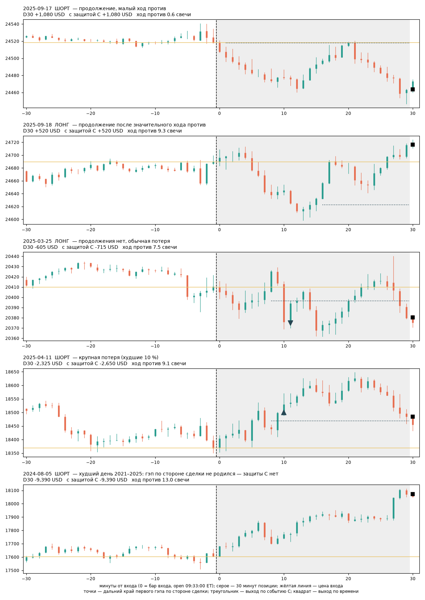

# S-17 — отклик открытия NQ: тридцать минут по стороне S-07

- **состояние:** исторический расчёт одной версии действия и одной версии защиты завершён. Ждёт решения
  трейдера; разрешением на торговлю не является.
- **исследовательский итог:** NQ 2021–2025, один контракт, одна попытка на сессию: **1 244 сделки из 1 255
  сессий календаря, +$77,5 на сделку после расхода $15, итог +$96 410, 4 года из 5 в плюсе, просадка $33 535,
  худший день −$9 390.** Результат целиком хвостовой: без лучших 5 % дней −$105 040. Защита по закрытию за
  дальним краем первого гэпа среднего не меняет (+$79,1), вдвое уменьшает обычную потерю, но худший день и
  просадку не лечит. Из четырёх исходов, допущенных предложением, это **первый** — положительный исторический
  кандидат в объявленной модели исполнения, — с риском без ценовой защиты, названным ниже в деньгах.
- **версия:** v1 от 2026-09-21: действие `D30` и единственная версия защиты `P`. Объявлены до счёта в
  docstring [`run.py`](S-17/run.py); после результата не менялись.
- **территория:** первичная NQ 2021–2025; NQ 2026 до конца канонической ленты (2026-05-01) — отдельно;
  2006–2012 и 2013–2020 — границы применимости; ES и YM — сравнение. Основная сессия XNYS,
  America/New_York. Поле RIZ не используется, объёма и ATR нет. **Вся эта история уже экспонирована**
  (S-07, S-09, 097): независимым подтверждением ничего здесь не является. Продолжение ленты
  2026-05-04…07-10 (`data/forward`) этим расчётом не читалось.
- **опирается на:** [S-07](S-07-drayf-pervyh-minut-sessii.md) — сигнал, сторона, календарь, единица
  «свеча», расход; [097 §5](../base/097-tsikl-ot-pervogo-kontakta-s-b-k-selektsii-t0-i-otkliku-na-otkrytie.md) —
  откуда взяты 30 минут и событие защиты. Существующие версии S-07 не изменены. Новый номер наследует всю
  их историю просмотра и выбора.

## Откуда идея и что видно

Предложение человека от 2026-09-21: «довести одну конкретную возможность участия в отклике открытия до
законченного исторического ответа… Мы проверяем использование уже наблюдавшегося направленного хода…
Мы больше не будем требовать, чтобы RIZ оказался источником следующей сделки».

Что пытаемся взять: ход, который рынок отдаёт после аукциона открытия акций в сторону, показанную первыми
минутами сессии. По 097 сторона не связана с ночным направлением и на 0,86 совпадает с первыми тремя
минутами; то же правило в пяти других запланированных часах даёт ноль. Вопрос карточки не «есть ли ход», а
**что получает один участник, который входит сразу и держит тридцать минут, и сколько стоит ценовая защита**.



Сцены выбраны правилом, но после результата: в 2025 году ближайшая к медиане своей группы сессия, пятая —
худший день пяти лет. Они объясняют правило и дыру защиты, а не доказывают результат.

## Что делаем

- **узнавание и отказ.** Дословно S-07: календарь XNYS; минута 0 закрывается в 09:30 ET; решение на
  закрытии минуты 3 (метка close 09:33). Нужны 30 непрерывных закрытых минут до неё включительно — 26 до
  открытия и 4 уже основной сессии, поэтому диапазон нельзя называть предрыночным. Нет минуты решения, нет
  префикса, рвётся сетка внутри позиции — сессия **не наблюдалась**, нулём она не считается.
- **вход и направление.** `mid` — середина максимума и минимума этих 30 минут. Close минуты 3 выше `mid` —
  лонг, иначе шорт. Рыночная заявка по open следующего интервала, то есть в 09:33:00.
- **выход `D30`.** Через 30 минут после входа: open бара, начинающегося в 10:03:00. Ценового стопа,
  доборов, повторных входов, безубытка и трейлинга нет.
- **защита `P` (единственная).** Событие из [`base/097/s07_invalidation_events.py`](../base/097/s07_invalidation_events.py)
  дословно: после входа ищется первый гэп, рождённый **по стороне сделки** (правило рождения машины RIZ,
  известно на закрытии третьего бара); первое закрытие минуты **за дальним краем** этого гэпа → выход по open
  следующей минуты. Событие проверяется на закрытии бара против гэпа, известного до этого бара. Пока гэп не
  родился и в сессиях без события действует только выход по времени. Это наблюдаемое событие, а не уровень,
  выбранный по деньгам.
- **позиции.** Один контракт NQ ($20 за пункт), одна попытка на сессию, расход $15 за круг, как в S-07.

## Что показал расчёт

Сверка: с выходом по close 30-й минуты расчёт даёт $82,29 на 1 569 сделках 2020–2026 — ровно строка сетки
S-07 (`summary_v1.csv`, minute 3 / horizon 30 / stop 0). То есть `D30` уже лежало в сетке S-07 числом; здесь
оно исполнено с выходом по следующей доступной цене и разложено по сессиям.

**NQ 2021–2025, первичная территория**

| | `D30` | `P` |
|---|---:|---:|
| Сделок / сессий календаря | 1 244 / 1 255 | 1 244 / 1 255 |
| Валовое на сделку | +$92,5 | +$94,1 |
| После расхода $15 | **+$77,5** | **+$79,1** |
| Медиана сделки | +$75 | −$75 |
| Доля прибыльных | 52,8 % | 43,4 % |
| Средний выигрыш / средняя потеря | +$1 119 / −$1 088 | +$1 036 / −$655 |
| 5-й процентиль | −$2 299 | −$1 605 |
| Худший день | −$9 390 | −$9 390 |
| Итог | +$96 410 | +$98 440 |
| Просадка | $33 535 | $41 390 |
| Среднее к разбросу на сделку | 0,052 | 0,067 |
| t по сессиям | 1,84 | 2,35 |
| Без лучших 5 % дней | −$105 040 | −$88 750 |
| Время в позиции | 100 % | 71 % |

По годам `D30`: 2021 +$2 410 · 2022 +$30 080 · 2023 −$8 680 · 2024 +$41 045 · 2025 +$31 555.
`P`: +$13 280 · +$22 695 · −$3 080 · +$17 900 · +$47 645. Лонги +$68,5, шорты +$86,4 — не бета растущего рынка.
11 сессий не наблюдались (разрывы ленты: 2022-08-30, 2024-07-19, 2025-07-21…23, 2025-10-21, 2025-10-27…31).

**Ухудшение исполнения и расходов, `D30`, на сделку:** расход ×2 → +$62,5; ×3 → +$47,5; хуже на тик с каждой
стороны → +$67,5; на четыре тика с каждой стороны → +$37,5. Выход по close 30-й минуты вместо следующего
open → +$76,6. Знак не держится на одном удачном допущении об исполнении.

**Типичный случай и источник денег — разные вещи.** Лучшие 10 % сессий несут 344 % итога; остальные 90 %
вместе отрицательны. Это устройство кандидата, а не дефект счёта: так же устроена S-07 (097 §5).

**Границы применимости.** NQ 2013–2020: валовое +$11,9, после расхода −$3,1. NQ 2006–2012: +$15,5 и +$0,5.
Ход в свечах там есть (S-07, 097), но в долларах он меньше расхода: деньги появляются, когда свеча дорогая
(медианная свеча 2021–2025: 4,4 / 7,8 / 5,3 / 6,1 / 7,5 пункта). ES 2021–2025: +$33,8 после расхода $30,
t 1,64, при удвоении расхода +$3,8. YM 2021–2025: −$10,4. NQ 2026, 78 сессий до 2026-05-01: `D30` +$487,7 на
сделку (t 2,0), `P` +$442,8 — горячий, уже виденный кусок, не подтверждение.

### Рентген риска: сколько стоит защита

Группы — описание для чтения, не фильтры. Пороги — квантили самой популяции.

| Путь после входа | Доля сессий | `D30` | `P` | Минута худшей точки |
|---|---:|---:|---:|---:|
| Продолжили, ход против меньше медианного | 41,6 % | +$1 245 | +$892 | 3 |
| Продолжили после значительного хода против | 11,2 % | +$649 | +$244 | 10 |
| Не продолжили, обычная потеря | 37,1 % | −$666 | −$462 | 23 |
| Крупная потеря, худшие 10 % | 10,0 % | −$2 646 | −$1 472 | 29 |

Ход против входа тенью: медиана по всем сессиям 6,4 свечи; у прибыльных 3,3 (90-й процентиль 8,7); у
хвостовых, которые платят за всё, — 2,0 (90-й процентиль 5,2). Оплачивающие сессии почти всегда идут сразу.
У крупных потерь худшая точка приходится на конец удержания: это ход в одну сторону против входа.

**Событие `C`.** Гэп по стороне сделки рождается в 95,4 % сессий, медианно на 5-й минуте; его дальний край
лежит медианно в 1,4 свечи против входа, в четверти сессий — уже выше входа. Событие наступает в 54,1 %
сессий, медианно на 12-й минуте. **После него до выхода по времени остаётся −$3 (t −0,07): ноль.** Оно
сохраняет 77 % денег хвостовых сессий, подрезает 36 % прибыльных сделок и уменьшает 54 % убыточных.

**Линейка «закрытие на d свечей против входа» — только описание цены защиты, версией не является.**
После закрытия на 2 / 4 / 6 / 8 свечей против входа до выхода по времени ещё остаётся +$55 / +$46 / +$51 /
+$33: выход там выбрасывает деньги (среднее падает до $38…$67). Остаток гаснет только у 12 свечей (−$11,
18 % сессий, 17-я минута) — это то же самое, что карточка S-07 называет пределом 16 свечей. Из всего
рассмотренного `C` — единственное раннее событие, после которого остатка нет.

**Дыра защиты.** В 57 сессиях из 1 244 (4,6 %) гэп по стороне сделки за тридцать минут не родился вовсе:
цена сразу пошла против. Средний результат этих сессий −$1 616; среди них худший день пяти лет (2024-08-05,
−$9 390) и 5 из 20 худших. Там `P` — это `D30` без всякой защиты. Поэтому худший день у обеих версий один, а
просадка у `P` глубже: защита режет часть прибыльных сделок и не закрывает именно те дни, ради которых её ставят.

### Сравнение с тем, что уже заморожено

Замороженная S-07 v1r1 (до 120 минут, предел 16 свечей, выход на 15-й минуте при минусе) на тех же годах
2021–2025 по своей карточке: +$24 525 / +$43 160 / +$22 405 / +$31 705 / +$64 795, всего **+$186 590**, пять
лет из пяти; её худший день за 2020–2026 −$4 620. `D30` на той же истории даёт вдвое меньше при большей худшей потере.
Причина видна в сетке S-07: без стопа 30 / 60 / 120 минут дают $82 / $130 / $175 на сделку в 2020–2026. Кривая
097 «остаток гаснет к 30-й минуте» снята в свечах, где все дни весят одинаково; в долларах дорогие дни
продолжают платить и после 30-й минуты. Оба расчёта стоят на одной экспонированной истории, выбор между ними
ею не оплачен. Это не повод подбирать горизонт — это граница чтения числа 30.

## Как повторить и что дальше

```powershell
python -B setups/S-17/run.py      # result.json, sessions_{NQ,ES,YM}.csv
python -B setups/S-17/scenes.py   # scenes.png, scenes.json
```

Зависимости — как у S-07 (`setups/S-05/requirements.txt`), входы — канонические `data/market/*` и
`setups/S-04/calendar.parquet`. Все числа карточки — из [`result.json`](S-17/result.json).

Не считалось и не заявляется: проскальзывание по реальным заявкам в 09:33:00 (минута самого дорогого спреда);
порядок внутри минуты для `P` не нужен — событие читается по закрытию. Наблюдение, **не проверенное и не
ставшее версией**: «гэп по стороне сделки так и не родился» — доступное по префиксу состояние худших сессий;
по уроку 097 оно, вероятно, пересказывает глубину минуса, а не добавляет к ней.

## История выбора

| Версия и дата | Что изменили и почему | Данные выбора | Альтернативы: здесь / всего по линии | Правило, код и итог |
|---|---|---|---|---|
| v1, 2026-09-21 | Первая и единственная. Сигнал S-07 без изменений; 30 минут — из профиля 097 на этой же истории; защита — событие `C` из 097 дословно | NQ/ES/YM 2006–2026, полностью экспонированы S-07 (сетка 675 конфигураций), S-09, 097 (около 35 чтений) | здесь: 2 версии, линейка из 5 глубин только как описание / по линии S-07+097: сотни | [`run.py`](S-17/run.py), [`result.json`](S-17/result.json) |

## Решение трейдера

Предлагается решить одно: какой обмен «деньги против потерь» приемлем на одном контракте — `D30` (типичная
потеря −$1 088, худший день −$9 390), `P` (типичная потеря −$655, худший день тот же, просадка глубже) или уже
замороженная S-07 v1r1 (вдвое больше денег на тех же годах, худший день за 2020–2026 −$4 620). На микроконтракте MNQ все
долларовые числа в десять раз меньше, расход в долях результата выше.

Что способно изменить решение: нетронутые 47 сессий 2026-05-04…07-10 лежат в `data/forward`. Прогон
замороженных `D30`, `P` и S-07 v1r1 на них — одноразовая проверка на вменяемость (ожидаемый t около 0,5,
вердиктом не станет), и тратится она один раз. Разрешения на живую торговлю нет.
