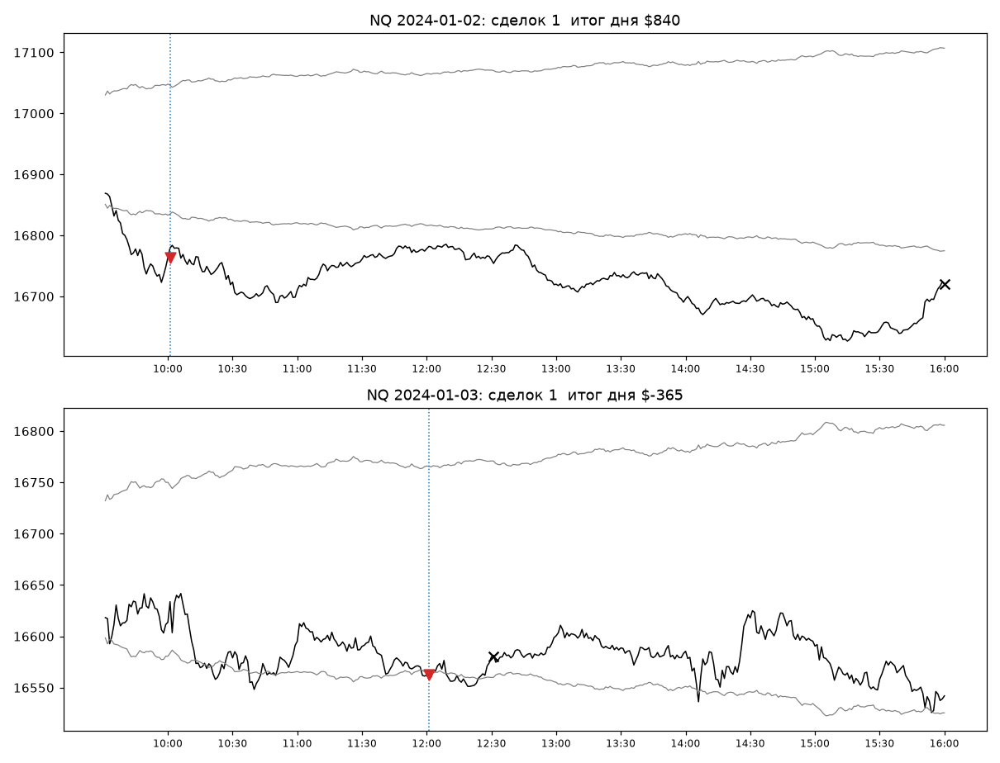

# S-18 — день вышел за свою обычную область

- **состояние:** исторический расчёт v0 завершён; положительный на NQ, хвостовой. Перенос во времени не
  установлен, поздние наблюдения слабее. Разрешения на живую торговлю нет.
- **исследовательский итог:** NQ 2020-01 … 2026-05-04, один контракт, расход $15: **1 555 сессий, сделка в 59 % из
  них, +$141,6 на сессию после расходов (t 3,2), +$220 190, 6 лет из 7, просадка $37 300, худший день −$6 285;
  прибыльных сделок 41,8 %, без лучших 5 % дней −$168 335.** Валовое в относительных единицах положительно во всех
  трёх эпохах на NQ и ES; то же правило в часы Лондона и Азии даёт ноль или минус. После выборки источника
  (2024-04+, 493 сессии): NQ +$163,7 (t 1,6), ES около нуля, YM минус.
- **уровень доказательства:** executable historical candidate: положительный исторический кандидат с адаптивной
  ценово-временной нормой и неустановленной современной устойчивостью. Это **адаптация определённой версии внешнего
  правила**, а не воспроизведение стратегии авторов: взят выход по возврату за ближнюю границу (рис. 5a источника),
  без VWAP и без размера позиции по волатильности. Параметры здесь не подбирались, но история выбора есть: выбраны
  источник, инструмент и безобъёмная версия; выбор авторов на SPY 2007 — начало 2024 наследуется.
- **частота буквально:** сделка в 59 % сессий (0,84 сделки на сессию); это регулярная возможность, не ежедневный вход.
- **версия:** v0, заморожена 2026-09-21. Хеши входов, кода и среды — [result.json](S-18/result.json).
- **территория:** NQ основной; ES и YM посчитаны тем же правилом. Минутные OHLC 2006-01-05 … 2026-05-04, основная
  сессия XNYS, America/New_York; входов вне неё нет, всё закрывается внутри дня. Поле RIZ не используется, объёма нет.
  Продолжение ленты 2026-05-04 … 07-10 этим правилом **не открывалось**.
- **опирается на:** ничего из `base/`. Собственное основание — [097](../base/097-tsikl-ot-pervogo-kontakta-s-b-k-selektsii-t0-i-otkliku-na-otkrytie.md) §5 и §8.4
  (ожидание S-07 сидит примерно в 10 % невернувшихся сессий; как они добирают результат после выхода S-07 — открыто).
  Полный ход линии, включая закрытую первую гипотезу, — [журнал](S-18/LOG.md).

## Откуда идея и что видно

Что пытаемся взять: **день, в котором цена ушла от открытия дальше, чем обычно уходит к этому времени, и продолжает
идти до закрытия.** Платят немногие такие дни; остальные стоят мелких возвратов.

Вопрос пришёл не из цепочки прежних нулей. Человек в начале сессии предложил рамку: сетап — доступное условие, при
котором конкретный способ участия получает определённое распределение выигрышей, потерь и времени риска; и назвал
«удержание экспозиции» одним из возможных предметов оплаты. Перед выбором проверено, что уже закрыто: импульс дня в
закрытие по ЗНАКУ хода (063), правило S-07 на других событиях суток (097), сплошной счёт по 1 440 минутам (061),
всплеск размаха (061), признаки сильного дня до открытия (063). Замечен пробел прибора: все часовые проходы G3
задавали сторону положением цены в 30-свечном окне, участие «по состоянию дня» предметом не было.

Дальше две внешние гипотезы, каждая задана источником целиком — час, сторона, правило, — поэтому мой перебор нулевой,
а годы после публикации служат невиданной правилом территорией на нашей же ленте.

1. **Час прихода Европы, 02:00–03:00 ET** (Boyarchenko–Larsen–Whelan, выборка 1998–2020). На нашей ленте
   воспроизводится на трёх индексах до 2019 года (лонг: t 2,5–4,0; лонг после падения последнего часа вчерашней
   сессии: m 0,14–0,18 — вдвое-втрое выше S-07), после 2020 года не обнаруживается (NQ 2021+ +0,28 б.п., t 0,6;
   знаковая версия t 1,2; ES и YM около нуля). В долларах одного контракта валовое не покрывало расход ни в одной
   эпохе, кроме 2020 года. Закрыта собственным правилом остановки. Урок: лента показывает крупный m, когда вопрос
   про вынужденный поток и часы, а не про геометрию свечей.
2. **Уход за норму времени дня** (Zarattini–Aziz–Barbon, SPY, 2007 — начало 2024) — эта карточка.

Возражение против посылки было названо до счёта: 097 не нашёл добавки лучшего закрытия к среднему остатку внутри
первых 120 минут позиции S-07. Оно не подтвердилось для этой конструкции: условие здесь — уход относительно нормы
времени дня, а выход — возврат в норму, и половину денег дают позиции, открытые после 11:30.

Первые две сессии 2024 года со сделкой, выбраны правилом до взгляда на исход. Серые линии — верх и низ обычной
области, пунктир — первая отметка входа: слева от него всё, что известно к решению. 2024-01-02: открытие с разрывом
вниз, в 10:00 цена ниже низа, шорт 16 763,50, выход в закрытие 16 720,75, +$840 (верх далеко, потому что строится от
вчерашнего закрытия). 2024-01-03: в 12:00 цена ниже низа, шорт 16 562,50; к 12:30 вернулась в область, выход
16 580,00, −$365. Координаты — [scenes.json](S-18/scenes.json). Сцены иллюстрируют правило, а не доказывают его.

## Что делаем

- **узнавание и отказ.** Норма(k) — среднее по 14 предыдущим сессиям величины |close минуты k / open сессии − 1|;
  k — минута основной сессии. Верх(k) = max(open сегодня, close вчера) × (1 + норма(k)); низ(k) = min(open сегодня,
  close вчера) × (1 − норма(k)). Всё это известно к минуте k. Нет open сессии, вчерашнего close, нормы хотя бы по 10
  сессиям из 14, цены на отметке или цены исполнения — сессия **неизвестна**, не ноль (NQ: 125 из 5 101).
- **вход и направление.** Отметки решения — закрытия минут 10:00, 10:30, …, 15:30. На отметке: закрытие выше верха —
  лонг, ниже низа — шорт, внутри — без позиции. Смена состояния исполняется рыночной заявкой по open следующей
  минуты; переворот — два оборота. Нулевая задержка на реальном рынке не гарантируется.
- **ведение и выход.** Выход, когда на очередной отметке цена снова внутри области, либо по последнему close
  основной сессии. Ценового стопа нет. Между отметками позиция ничем не защищена: это часть цены участия, она
  измерена ниже. Наблюдаемой ошибки идеи, отличной от возврата в норму, у конструкции нет.
- **роль нормы (решение человека 2026-09-21).** Правило использует **адаптивную оценку типичного движения**: средний
  абсолютный относительный уход цены от открытия к той же минуте дня за 14 предыдущих сессий (определение раздела 3
  первоисточника). Слово человека: «S-18 не снимать. Эту норму допускаю как отдельное ценово-временное сравнение»;
  «запрещён ATR и его замаскированное воспроизведение; не запрещено любое осмысленное статистическое сравнение цен…
  Это узкое решение по данной конструкции, не разрешение на произвольный каталог индикаторов». Отличие от ATR
  содержательное: ATR усредняет размах баров; здесь измеряется положение относительно временного якоря — цена могла
  широко колебаться и вернуться к открытию, размах баров будет большим, а уход от открытия нулевым. Окно 14 и
  множитель 1 взяты у источника и не перебирались.
- **позиции.** Один контракт, не больше одной позиции одновременно. Расход $15 за оборот NQ ($30 ES, $15 YM).

## Что показал расчёт

| v0, после расходов | NQ 2006–2012 | NQ 2013–2019 | NQ 2020–2026 | NQ 2024-04+ |
|---|---:|---:|---:|---:|
| сессий (доля со сделкой) | 1 680 (0,65) | 1 741 (0,58) | 1 555 (0,59) | 493 (0,57) |
| сделок на сессию / минут в позиции | 0,92 / 108 | 0,81 / 102 | 0,84 / 104 | 0,79 / 101 |
| средняя на сессию, $ (t) | −3,1 (−0,5) | +27,1 (2,3) | **+141,6 (3,2)** | +163,7 (1,6) |
| валовое, б.п. на сессию (t) | +2,46 (1,5) | +3,32 (3,2) | +5,25 (3,6) | +4,68 (1,8) |
| итог / лет в плюсе | −$5 205 / 4 из 7 | +$47 235 / 5 из 7 | **+$220 190 / 6 из 7** | +$80 685 / 2 из 3 |
| просадка / худший день | $15 110 / −$1 775 | $6 600 / −$3 600 | $37 300 / −$6 285 | $37 300 / −$6 285 |
| без лучших 5 % дней | −$61 285 | −$90 890 | −$168 335 | −$81 930 |
| прибыльных сделок; выигрыш / проигрыш | 0,315; $252 / −$121 | 0,358; $505 / −$230 | 0,418; $1 695 / −$927 | 0,407; $2 187 / −$1 151 |

По годам 2020–2026: +$25 235 / +$25 430 / +$42 735 / +$44 890 / +$46 135 / +$37 190 / −$1 425 (76 сессий 2026 года).
В ранние эпохи ход в относительных единицах был, но пункт стоил дёшево относительно расхода — то же, что у S-07.

**Распределение и цена участия (NQ 2020–2026, 1 312 сделок).** Квантили сделки: 5 % −$2 180, медиана −$175, 95 %
+$3 572; худшая −$4 620, лучшая +$35 895. Ход против внутри сделки: медиана $710, p95 $2 712, худший $5 800; у
прибыльных сделок p90 хода против $965. В сделке 30 / 60 / 209 минут (квартили). Сессий в плюсе 27 %, в минусе 32 %,
без сделки 41 %; самая длинная серия убыточных сессий — 6. Типичный случай — небольшой минус; деньги приносит
меньшинство длинных дней. Пять лучших дней дают 33 % итога, один 2025-04-09 — $29 860; без апреля 2025 остаётся
+$182 435. Месячный бутстреп суммы: $98 992 … $344 925, доля ниже нуля 0,0002 (приближение при обменяемости месяцев).

**Не бета.** Лонги +$189, шорты +$145 на сделку; те же интервалы удержания вслепую в лонг дают +$29 валового против
+$183 у правила.

**Братья.** Валовое б.п. на сессию по эпохам: ES +5,37 (t 3,7) / +1,73 (2,0) / +3,78 (3,4); YM +4,19 (3,0) / +1,11
(1,4) / 0,00. В деньгах ES 2020–2026 +$51,3 на сессию (t 2,1, 5 лет из 7), YM −$11,6.

**То же правило в других местах** (якорь вместо открытия сессии, без члена вчерашнего закрытия): утро Лондона
03:00–09:25 ET — валовое отрицательно во всех эпохах на NQ и ES (−0,2…−2,7 б.п., t до −2,3); Азия — ноль. Явление
принадлежит основной сессии США.

**Рядом с S-07 v1r1 (2020–2026, 1 551 общая сессия).** Связь дневных денег r = 0,18; обе в минусе в 20 % сессий;
просадка суммы $32 935 против $37 300 и $35 250 порознь; итог суммы $445 005, худший день суммы −$10 110. Позиции,
открытые до 11:30, дали $104 950, позже — $115 240: конструкция обращается к другой части дня. Независимого источника
преимущества слабая связь не устанавливает: обе версии могут получать деньги от связанных редких трендовых сессий.
Общей модели размера и риска нет, сумма двух единиц портфелем не является.

**Расходы.** При $30 за оборот: +$128,9 на сессию, t 2,9, 6 лет из 7.

## Из чего состоит результат (анатомия замороженной v0)

Правило не менялось; объявление и код — [anatomy.py](S-18/anatomy.py), вывод — `anatomy_out.txt`. Каждая отметка
отнесена к одному из видов: **F** — свежий выход за норму, **S** — остались за нормой, **R** — вернулись внутрь
(сторона прежняя), **I** — внутри и были внутри (сторона = простой знак хода от открытия). Каждый удержанный интервал
v0 начинается отметкой F или S, поэтому валовое раскладывается без остатка; сверка с дневными деньгами v0 —
расхождение $0,00 на 4 975 сессиях.

| NQ, б.п. (t по сессиям) | 2006–2012 | 2013–2019 | 2020–2026 |
|---|---:|---:|---:|
| I: простой знак дня, до следующей отметки | +0,72 (2,6) | −0,02 (−0,1) | −0,09 (−0,4) |
| I: простой знак дня, до закрытия | −1,56 (−1,0) | −0,51 (−0,6) | +1,52 (1,0) |
| F: первый интервал после свежего выхода | +0,70 (0,8) | +1,09 (1,7) | +1,18 (1,1) |
| S: следующий интервал, пока остаёмся за нормой | +0,68 (1,4) | +0,94 (2,8) | **+1,62 (3,6)** |
| R: после возврата, прежняя сторона, до закрытия | −2,21 (−0,6) | −3,61 (−1,5) | +9,87 (2,1) |
| Валовое v0: после F / после S | $5 400 / $12 525 | $18 930 / $49 545 | **$38 565 / $201 305** |
| Валовое v0: до 11:30 / 12:00–13:30 / 14:00+ | 5 550 / 3 150 / 9 225 | 30 820 / 17 630 / 20 025 | 94 275 / 59 700 / 85 895 |

1. **Простой знак хода внутри нормы результата не воспроизводит.** В проверенном сравнении знак хода дня, пока цена
   внутри нормы, не несёт ничего до закрытия ни в одной эпохе на NQ и ES (согласуется с 063). Это поддерживает
   выбранное описание сцены — выход за типичное для этого часа. Необходимым условием любого внутридневного
   преимущества это не устанавливает (уточнение человека 2026-09-21).
2. **Заработанное распределено по времени в пользу интервалов удержания.** Первый получас после свежего выхода на NQ
   около нуля во всех эпохах;
   84 % валового 2020–2026 набрано в интервалах, где позиция уже была и цена осталась за нормой. Состояние S
   положительно во всех шести клетках (три эпохи × NQ, ES; t 1,4–3,7) — самая переносимая часть конструкции. На ES
   в 2020–2026 доля после F выше (51 %), в двух ранних эпохах — как на NQ. Граница использования (человек,
   2026-09-21): вход обеспечивает попадание в оплачивающую часть пути; большая доля денег на последующих интервалах
   сама по себе не означает, что первоначальный вход можно без потерь отложить.
3. **Позднее подключение оплачивается только в последней эпохе.** Свежие выходы после 12:00 в 2020–2026 дают до
   закрытия +13 б.п. (t 2,2–2,6; ES +7,5 и +11,8), а в 2006–2019 — ноль или минус (NQ −8,6 / −5,1 в середине дня).
   Ранние свежие выходы (до 11:30) одного знака во всех эпохах (+5,5 / +4,7 / +11,8). Это наименее подпёртая часть.
   Таблица по времени дня добавлена после частей A–C, до части D; в объявлении её не было.
4. **Роль выхода по возврату в норму — защитная; среднего он не увеличивает.** После возврата прежняя сторона до закрытия меняет знак
   между эпохами. Выход, заданный базовой моделью источника (держать до противоположной границы), в 2020–2026 даёт
   +$176 на сессию против +$142 у v0, но худший день −$18 900 против −$6 285; в 2013–2019 просадка $18 275 против
   $6 600. Роль выхода v0 названа прямо: защитное ограничение, уменьшающее худший день втрое; заменой v0 сравнение
   не является. Граница использования (человек, 2026-09-21): части стратегии не независимы — выход меняет
   длительность экспозиции, хвост потерь и возможность повторного участия; его ценность не обязана выражаться
   увеличением среднего.

## Что означает слабость последних лет

Сравнение 2020-01…2024-03 (1 062 сессии) с 2024-04…2026-05 (493), сессионный бутстреп, NQ:

| Величина | раньше | позже | разность, 95 % |
|---|---:|---:|---:|
| свежих выходов на сессию | 0,868 | 0,793 | −0,075 [−0,168; +0,015] |
| доля свежих выходов, оставшихся за нормой | 0,657 | 0,651 | −0,005 [−0,062; +0,052] |
| ход, если остались, б.п. | +16,96 | +13,57 | −3,39 [−7,12; +0,41] |
| цена ложного выхода (вернулись), б.п. | −31,03 | −25,50 | +5,53 [−0,43; +11,45] |
| ход следующего интервала в состоянии S, б.п. | +1,50 | +1,90 | +0,40 [−1,48; +2,50] |
| валовое v0 на сессию, б.п. | 5,52 | 4,68 | −0,84 [−6,85; +5,90] |

На ES, ближайшем к инструменту источника: 5,01 → 1,13 б.п., разность −3,88 [−8,07; +0,37].

**Вынуждено.** Ни одна из трёх частей — частота оплачивающих продолжений, их размер, цена ложных выходов — не
различима на имеющемся свидетельстве: ноль внутри каждого интервала. Блок в 493 сессии при разбросе сессии 58 б.п.
отличает разность не меньше 6,3 б.п., то есть больше самого эффекта (5,5). На NQ «слабость» в относительных единицах
почти отсутствует; впечатление слабости создают ES, последний кусок в 107 сессий (0,57 б.п.; 26-й процентиль среди
окон той же длины всей прежней истории) и то, что долларовый итог NQ позднего блока во многом один день. Поздний
блок NQ стоит на 66-м процентиле окон той же длины за 2006…2024-03 (независимых окон девять) и на 11-м — внутри
2020…2024-03. Это контекст, не оправдание.

**Какой вопрос меняет решение.** Не вопрос о причине. Чтобы отличить «эффект уменьшился вдвое» от «не изменился»,
нужно порядка 1 700 новых сессий; такого свидетельства не будет в разумный срок, а разбор причин на имеющемся блоке
закончится подбором. Решение о кандидате меняет только верхняя строка замороженной v0 на новых сессиях: при
m ≈ 0,08 на сессию до t ≈ 2 нужно около 625 сессий (два с половиной года). Обе оценки (625 и 1 700) показывают масштаб
неопределённости при предполагаемом сохранении эффекта и разброса; ясного ответа именно после этих чисел они не обещают.

## Что слабее, чем выглядит

- **После выборки источника опора слабая и смешанная:** NQ t 1,6 и в значительной мере один день; ES +1,13 б.п.
  (t 0,7); YM −0,2. На 493 сессиях прибор видит только m ≥ ~0,09.
- **Поздние наблюдения одного знака:** кусок 2025-11-01 … 2026-05-04 плоский (+$10 на сессию, январь 2026 −$16 105);
  ES по годам 2024 / 2025 / 2026 — +2,4 / +0,4 / −0,6 б.п.; NQ 2025 без одного дня даёт +$7 330. Это три коротких
  наблюдения, не установленное затухание.
- **YM в 2020–2026 — ноль.** Знак на братьях совпадает в ранние эпохи, в последней — только NQ и ES.
- **Результат хвостовой так же, как у S-07:** без лучших 5 % дней минус в каждой эпохе.
- **Вся лента до 2026-05-04 посчитана разом;** отложенного куска у меня не было.

## Перепроверка версии

- Узнавание не смотрит вперёд: 300 случайных (сессия, отметка) пересчитаны по массивам с удалённым будущим —
  расхождений 0. Норма строится только из предыдущих сессий.
- Соседи правила — только диагностика, победитель не выбирался: окно 7 / 14 / 28 — +$156 / +$142 / +$141 на сессию;
  множитель 0,75 / 1 / 1,25 / 1,5 — +$134 / +$142 / +$127 / +$84; шаг отметок 15 / 30 / 60 минут — +$104 / +$142 /
  +$154; t 2,3–3,6, поверхность гладкая. Шаг 60 и окно 28 дают меньшую просадку ($23 075 и $30 150) — наблюдение,
  версией не стало.
- Повтор из каталога `setups/S-18`: `python -B run.py`, затем `checks.py`, `elsewhere.py`, `anatomy.py`, `scenes.py`; первая гипотеза —
  `hours.py`, `hours2.py`. Выводы прогонов сохранены в `*_out.txt`, дневные деньги и сделки — `band_daily_*.csv`,
  `band_trades_*.csv`.

## История выбора

| Версия и дата | Что сделано и почему | Данные выбора | Альтернативы: здесь / всего | Правило и итог |
|---|---|---|---|---|
| v0, 2026-09-21 | Адаптация версии источника с выходом по возврату за ближнюю границу (рис. 5a), без VWAP (объём исключён) и без размера позиции по волатильности; параметры источника. Первоначально ошибочно названа «базовой моделью источника» — база авторов выходит на противоположной границе; поправка описания 2026-09-21, правило и числа не менялись | Вся лента 2006–2026 разом | Внешних гипотез в линии 2 (первая закрыта остановкой); внутри второй перебора нет, 10 соседей посчитаны после v0 как диагностика | [run.py](S-18/run.py), [result.json](S-18/result.json) |

Неучтённым остаётся подбор авторов источника (включая их выбор между тремя способами выхода) и весь прежний подбор
на этой ленте. После v0 посчитаны как диагностика и версиями не стали: 10 соседей, то же правило в двух других окнах
суток, выход базовой модели источника.

## Решение человека и что предлагается дальше

**Решение 2026-09-21 (слово человека):** «S-18 не снимать»; «сейчас S-18 заслуживает места в библиотеке как
положительный исторический кандидат с адаптивной ценово-временной нормой и неустановленной современной
устойчивостью». Не усиливать: отсутствие подбора здесь — не отсутствие истории выбора; слабая связь с S-07 не
устанавливает независимый источник; современная устойчивость — главное неизвестное; 59 % сессий — регулярная
возможность, не ежедневный вход.

**Решение о последующем наблюдении (человек, 2026-09-21).** v0 остаётся замороженной; новая анатомия не меняет уже
проверяемое действие. Накопительное наблюдение начато с доступных последующих сессий, включая 47 сессий
2026-05-04 … 07-10. Точки рассмотрения — 125, 250 и 500 сессий: расписание обзоров, не три попытки получить
положительный вердикт. Предложенное мной правило «на 250 сессиях минус — закрыть версию» **не принято**: наблюдавшийся
минимум исторического окна не граница будущего; отрицательный итог на 250 сессиях может означать «нет основания
продвигать кандидата» или повод отложить по практическим причинам, но не «положительное ожидание опровергнуто».
Заморозка — [FREEZE_FORWARD.md](S-18/FREEZE_FORWARD.md), журнал — `S-18/forward_ledger_NQ.csv`.

**Следующий исследовательский вопрос (человек, 2026-09-21), отдельно от v0:** является ли сохраняющееся отклонение
(«остались за нормой») доступной возможностью участия само по себе — в том числе для наблюдателя, который прежде не
участвовал, — или это только название той части траектории, которую удерживала v0. Задержанный вход, дополнительное
подтверждение и новый выход заранее не назначены.

Разрешения на живую торговлю нет и настоящей карточкой оно не создаётся.
